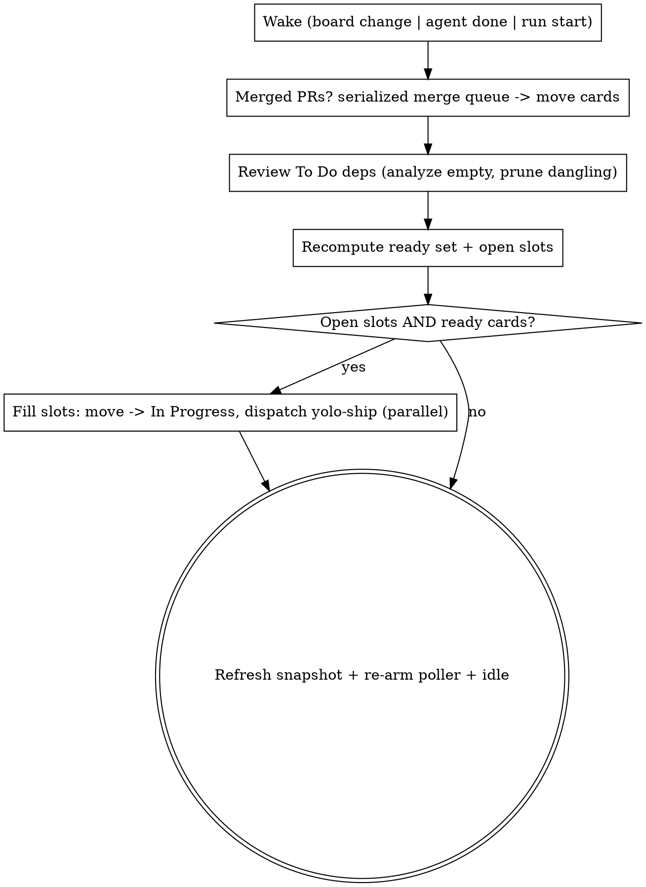

# auto-ship — drain the "TO DO" board in parallel

## Overview

The GitHub **"TO DO"** Projects v2 board (org `project-ax`, project **#1**, linked to
this repo) is the single source of truth for tracked work — see CLAUDE.md ›
**Task Board Policy**. This skill drains it: **watch** the To Do lane for changes
(token-free, ≈once a minute), **review** dependencies whenever it changes, **ship**
every ready card (no unmet dependency) via `yolo-ship` — up to 3 in flight — **merge**
the green PRs through a **serialized** queue, and **loop continuously**. Humans and
agents both edit the board live; you react to whatever lands in To Do.

You are the **orchestrator**. You dispatch agents; you do not implement. Heavy work
lives in subagents so your context stays lean. All durable state lives **on the
board** (+ open PRs + a local failure journal), so a run is fully **resumable** — and
**crash-safe**: if the CLI dies mid-flight, its agents and poller die with it,
stranding cards in In Progress / In Review. Re-invoke `/auto-ship` and the run-start
**reconcile** pass recovers every orphan from board + PR ground truth
(`references/github-project.md` §7) before draining further. The same path handles a
clean resume when your context grows.

Design: `docs/plans/2026-05-24-auto-ship-design.md` (revised — board-as-source-of-truth).
Board mechanics + the poller: `references/github-project.md`. Dispatch/handoff
templates: `references/templates.md`.

## Prime directive — context discipline

Hold **only** the ready set (task IDs + deps) and **≤1 line of status per in-flight
card**. Never read task source, diffs, or agent transcripts into your context. Card
**bodies** (including the live progress block, §6) are never read into your context
either — the `append_progress` read-modify-write stays **shell-side**, surfacing only
`progress: …` to you. Enforce a **≤150-word structured handoff** from every dispatched
agent. After every merge, **re-derive** state from the board — do not accumulate
across passes.

| Thought | Reality |
|---|---|
| "Let me peek at the diff to check it" | The agent + CI + Codex already did. You hold a one-line status. |
| "I'll remember what I dispatched last pass" | Re-read the board. Cross-pass memory is the trap; the board is truth. |
| "I'll merge these two at once to be fast" | The merge queue is serialized. One PR at a time, always. |
| "I'll `item-list` again for that id / body / snapshot" | **One** board read per pass (`item-list` is a heavy GraphQL query); bind `$ITEMS` / `board_snapshot` and reuse it for the ready set, ids, bodies, and snapshot. Re-querying per item exhausted the 5000/hr GraphQL budget and stalled the loop for ~6 min. |
| "I'll fire three `item-edit`s to move these cards" | Collapse coincident writes into one aliased mutation with `board_batch` (§2b/§4). N field writes → 1 request. |
| "Context is getting big, push through" | End + re-invoke `/auto-ship`. State is on the board; resume is free. |

## Board = state model & readiness

Source of truth = the "TO DO" board (`gh project item-list 1 --owner project-ax
--format json`). Resolve owner/number + the `Status` and `Depends on` field ids once
at run start (`references/github-project.md` §0–2).

- **Card** — title prefixed `[TASK-ID]`; dependencies in the **"Depends on"** field
  (`gh` JSON key `"depends on"`): space/comma-separated Task IDs. **Empty = not yet
  analyzed; `none` = analyzed, no deps.** Don't conflate the two.
- **Lane** = the `Status` field: **Backlog · To Do · In Progress · In Review · Done · Parked**.
- **In-flight** — cards in **In Progress** or **In Review** (each has, or will have, an
  open PR titled `[TASK-ID]…` — `gh pr list`).
- **Done** — Done lane (merged). **Parked** — quarantined (see Failure handling),
  excluded from the ready set.

A To Do card is **ready** iff every Task ID in its "Depends on" points at a **Done**
card (empty / `none` / all-Done ⇒ ready). **`(walk)`-titled cards are never
yolo-shipped** — see Cluster-walk lane.

**Concurrency cap:** **≤ `--max-parallel` (default 3)** in-flight cards
(In Progress + In Review combined). Open slots = cap − in-flight.

## Control loop

At run start: resolve the board, ensure the 6-lane `Status` set + the `Depends on`
field exist (`references/github-project.md` §1–2), write the poller, the progress
helper (`.claude/auto-ship-progress.sh`, §6), **and** the batched board helper
(`.claude/auto-ship-board.sh`, §2b) + take the owner lock (§7), **reconcile any
orphaned in-flight cards** (§7 — this is the crash/resume recovery step), print the
plan, launch the poller, then idle. You then run the same pass on **every wake**:



Three wake signals, all run the same pass:

1. **Board change** — the poller (below) exits when the To Do lane changes.
2. **Agent completion** — a dispatched background agent finishes (a PR is ready / a slot frees).
3. **Run start / resume** — and **only** this wake additionally runs the §7
   reconcile pass *first*. A fresh invocation owns no live agents, so every In
   Progress / In Review card is by definition an orphan to recover; a board-change or
   agent-done wake has live tracked agents and must **not** reconcile.

**Print the plan before the first dispatch** (ready set + skip-list + lane plan) so a
watching human can interrupt. `--dry-run` runs one review+recompute pass, prints the
plan, and stops — **no dispatch, no board writes, no poller**.

## Dependency review (on every To Do change)

When the To Do lane changes, review the **whole** lane before dispatching:

- **Analyze the un-analyzed.** For each To Do card whose "Depends on" is **empty**,
  read its title/body against the other open cards and write the Task IDs it truly
  depends on — or `none` if it stands alone. (`none` marks it analyzed so you don't
  re-analyze it every tick.)
- **Prune the dangling.** For each To Do card with deps, drop any referenced Task ID
  whose card **no longer exists** on the board (it was deleted/renamed). A reference
  to a vanished task is not a real block — remove it. (Deps that point at a **Done**
  card stay — they're satisfied, and they record the history.)

You are the **sole writer** of the "Depends on" field's analysis. (Humans may
hand-set deps too; you fill gaps and prune, you don't overwrite a human's explicit
deps unless they dangle.)

## The poller (token-free, ≈once a minute)

Write it at run start (gitignored) and launch it **in the background** — it burns
**no model tokens** while idle and exits (re-invoking you) the moment To Do changes.
Full script + the snapshot-refresh discipline: `references/github-project.md` §5.

Launch via the Bash tool with `run_in_background: true`. On exit it re-invokes you →
run a loop pass → **refresh the snapshot to the current To Do hash** (so your own
board writes this pass don't immediately re-fire it) → **re-launch the poller**. The
first launch fires right away (empty snapshot) — that's the run-start review.

## Dispatching

Fill every open slot, **topmost ready card in the To Do lane first** (ties: oldest
card). For each:

1. Move the card → **In Progress** (`references/github-project.md` §4). No body
   seeding needed — the agent's first phase line creates the progress block (§6).
2. Launch a **background** `general-purpose` agent running `yolo-ship` in
   **orchestrated mode** on that one card (`Agent`, `run_in_background: true`,
   **`isolation: "worktree"`**), using the **code-lane dispatch prompt** in
   `references/templates.md` — pass the card's `[TASK-ID]`, title, body, its **item
   node id** (`<ITEM-ID>`), and the **absolute path** to `.claude/auto-ship-progress.sh`
   so it reports progress live on its card. **`isolation: "worktree"` is mandatory** —
   it gives each agent its own git worktree so no agent ever works in the shared main
   checkout (concurrent agents on the main checkout clobber each other's HEAD/working
   tree + `.claude/memory` — the ARCH-2 incident). The orchestrator's own checkout
   stays on `main` for the serialized merge queue.
3. Append `dispatch <TASK-ID>` + timestamp to `.claude/auto-ship-log.md`.

Launch all slot-fills in a **SINGLE message** (concurrent). If ready cards exceed
open slots, dispatch up to the cap and leave the rest — fill a freed slot on the next
merge. The cap bounds concurrent CI + token burst (each agent is a full `yolo-ship`
run with its own CI + Codex pass).

Each agent runs `yolo-ship` on exactly one card in **orchestrated mode** —
green+mergeable PR, **no self-merge, no board write** (you own board writes) — and
returns the ≤150-word handoff.

## Merge queue (serialized — you own it)

Process completed code PRs **one at a time**:

```bash
git fetch origin
gh pr view <n> --json mergeable,statusCheckRollup     # confirm green + mergeable
# if NOT mergeable (main moved): check out the branch, rebase onto main,
#   resolve conflicts, push, wait for CI to re-green, then continue.
gh pr merge <n> --squash --delete-branch
git checkout main && git pull --ff-only
```

On a `pr-green` handoff (PR open, pre-merge): move the card → **In Review** (the agent
already logged `PR #<n> opened` in its progress block — you no longer append a link).
After the merge: move the card → **Done**, `append_progress … "merged #<n> ✅"` on the
card, append `merged #<n>` to the journal, and **create a new To Do card for each
follow-up** the agent reported (set its deps). You are the **sole writer of the
routing fields** (`Status`, `Depends on`) and the sole card-mover; the only thing an
agent writes is the progress block of its own In-Progress card (§6). **Never** merge
two PRs concurrently.

**Cross-package backstop (auto-merge safety).** PR CI runs only affected-package
tests for speed (`.github/workflows/ci.yml`), so the **push-to-main full suite** is
what catches cross-package breakage (e.g. a shared-table teardown no single package
exercises — see `feedback_new_fk_breaks_downstream_test_teardown`). After each merge,
check the **main** run (`gh run list --branch main --limit 1`); if it goes **red**,
**HALT and report** — do not merge onto a broken `main`. Resume once main is green.

## Cluster-walk lane (`(walk)` cards)

Manual-acceptance walks (cards with **`(walk)`** in the title) are **auto-drained, not
human-gated** — `k8s-acceptance-loop` drives the UI through Playwright MCP against the
cluster autonomously, so no human is in the loop. They are **not** yolo-shippable
(they run via `k8s-acceptance-loop`, never `yolo-ship`) and run **one at a time** — a
**serialized** walk lane, never concurrent with another walk — and they **never
consume a code slot** (a walk runs in parallel with up to `--max-parallel` code
cards). A ready `(walk)` card (deps satisfied) is drained like any other ready card;
route it to the walk lane instead of the code lane. Deps-gated walks may sit in
**Backlog** until earned, then move to **To Do** like any card.

The **only** gate is cluster reachability — there is no human-approval gate:

- Pre-flight `kubectl --context kind-ax-next-dev get nodes`. If the cluster — or
  `kubectl` / `kind` / the container runtime (e.g. a stopped Docker daemon) — is
  **unreachable**, this is an *environment limit*, not a human gate: leave the walk
  where it is with a note, keep draining the code lane, and resume walks once the
  cluster is reachable. Do **not** quarantine a walk for an unreachable cluster.
- Dispatch ONE walk at a time via the **walk-lane dispatch prompt** in
  `references/templates.md` (one background `k8s-acceptance-loop` agent), moving the
  card → **In Progress** for the duration.
- Rebuild the agent image first for image-baked walks (per [[docker-build-cache-runner-fixes]]).
- **Pass** → move the card → **Done**. **Fail** → create a new To Do card carrying
  `parent` + the failure signature; the normal loop picks it up under Failure handling.

## Failure handling & loop prevention

Every failing agent/walk returns a **normalized failure signature** (rules in
`references/templates.md`). Guards (all read from `.claude/auto-ship-log.md`, so they
survive a resume):

1. **Same-signature breaker (core).** A follow-up records `parent` + the parent's
   signature `S`. When the parent re-runs after its fix merges and fails with the
   **same `S`** → **quarantine the parent** (move → Parked) and spawn **no** new
   follow-up. The loop dies on the first repeat. A **different** signature = real
   progress → a follow-up may spawn (bounded below).
2. **Attempt cap = 2** per task. Two failures (or two identical signatures) → quarantine.
3. **Follow-up chain depth cap = 2.** Each spawned card carries `depth`; at the cap, leave it in To Do for a human instead of spawning further.
4. **Global breaker:** halt + report if a run exceeds **10** auto-spawned cards OR **3×** the initial actionable-card count in total dispatches.
5. **Stall detector:** a pass that leaves the Done-count unchanged AND the ready-set identical → halt + report.

Quarantine is visible: move the card → **Parked**, prefix its title `🛑`,
`append_progress … "🛑 parked — attempt=<N> sig=<signature>"` on the card (§6), and
add a journal row. Excluded from the ready set.

## Progress & observability

The **board is the dashboard** — every state is visible in the GitHub Projects UI,
now down to a **live per-card heartbeat**: each In-Progress card's body carries the
delimited progress block (§6) the building agent appends to at every phase boundary
(`brainstorm done`, `task k/N done`, `codex review clean`, `PR #<n> opened`, `CI green
✅`), with `⚠`-prefixed exception lines (codex findings, CI red, blocked) and the §7
recovery audit trail. Open a card to read its story; the kanban tiles stay clean
(Projects v2 renders the body only in the detail pane).

Locally, gitignored only:

- `.claude/auto-ship-log.md` — append-only journal + failure ledger (dispatches,
  merges, attempt counts, signatures, crash-recoveries). The loop-breakers read it; a
  resume rebuilds attempt history from it.
- `.claude/auto-ship-todo-snapshot.txt` — the poller's last-seen To Do hash.
- `.claude/auto-ship-progress.sh` — the shell-side `append_progress` helper (§6).
- `.claude/auto-ship-board.sh` — the batched board helpers `board_snapshot` + `board_batch` (§2b).
- `.claude/auto-ship-board.json` — the once-per-pass board snapshot cache (§3).
- `.claude/auto-ship-owner.lock` — the single-instance heartbeat (§7).

On resume, rebuild the ready set from the **board** + `gh pr list` + the journal, and
run the §7 reconcile to recover orphaned in-flight cards.

## Termination

`auto-ship` runs **continuously** by default: after draining the current ready set it
idles on the poller, waking when To Do changes or a slot frees. Stop it by ending the
session, or pass **`--once`** to drain the current ready set and exit (the old
batch-drain behaviour). Either way the board remains the durable record. On a clean
`--once` exit, emit a final report: shipped (PR#s), parked (reasons/signatures), still
in-flight, and any walk-filed follow-ups.

## Safety

- `--dry-run` prints the plan (ready set + lane plan + skip-list) and stops — no dispatch, no board writes, no poller.
- The plan is printed before the first dispatch regardless; a watching human can interrupt.
- **Cost/throughput dial:** `--max-parallel N` (default 3) bounds concurrent in-flight
  cards/PRs — each is a full `yolo-ship` run with its own CI + Codex pass. Lower it to
  smooth CI/token burst, raise it to drain a wide To Do lane faster. (yolo-ship tiers
  Codex effort + subagent model to each task's risk/size — see its Phase 3/5 — so
  small cards are already cheaper.)
- First-ever validation: point auto-ship at a throwaway 2-card To Do (one depending on
  the other) before the real board, and at a deliberately-failing card to confirm the
  breaker parks it.

## Red flags — you are rationalizing

| Thought | Reality |
|---|---|
| "I'll just implement this small card inline" | You're the orchestrator. Dispatch it. Inline work blows the budget. |
| "The walk failed; I'll re-file the fix again" | Same signature ⇒ quarantine. Re-filing the same failure is the loop you must not create. |
| "Two PRs are green, merge both now" | Serialized queue. One at a time, rebase-on-conflict. |
| "I'll skip the plan print, the ready set looks obvious" | Print it first. Auto-merging to main is high blast-radius. |
| "I'll let the agent move its own card / set its deps" | Agents never write the **routing fields** (`Status`, `Depends on`) or another card. The one thing an agent writes is the progress block of its own In-Progress card (§6); you own all routing + moves. |
| "I'll read the card body to see how far it got" | Never pull a body into context — the `append_progress` RMW is shell-side (§6). For recovery you key off the `Status` lane + PR ground truth (§7), not the body. |
| "Re-invoked after a crash — I'll just start dispatching" | Run the §7 reconcile **first**: orphaned In Progress / In Review cards (PR → merge queue; no PR → reset to To Do) before draining, or they wedge slots forever. |
| "An In-Progress card looks stuck, I'll re-dispatch it" | Only on a **run-start** wake (no live agents). On a board-change/agent-done wake those agents are live — reconciling would double-dispatch. |
| "I'll poll the board myself each minute" | That burns tokens. The background poller is token-free and re-invokes you on change. |
| "This walk card is ready, I'll yolo-ship it" | `(walk)` cards run via the serialized k8s-acceptance-loop, never yolo-ship. |
