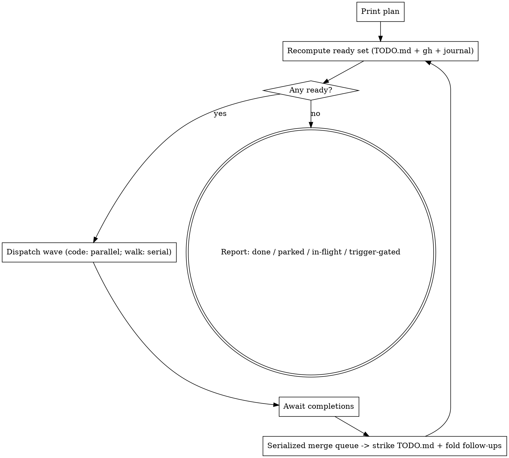

# dag-ship — drain the TODO.md DAG in parallel waves

## Overview

`TODO.md` carries a parallelization DAG: a fenced ```mermaid edge-map, inline
`[TASK-ID]` checkbox lines, a ⚠ cluster-walk lane, and a 🚫 trigger-gated set.
This skill drains it — find every **ready** task (no unmet dependency), ship each
via `yolo-ship` in parallel, merge the green PRs through a **serialized** queue,
recompute what's now unblocked, and loop until nothing remains but trigger-gated
or quarantined work.

You are the **orchestrator**. You dispatch agents; you do not implement. Heavy
work lives in subagents so your context stays lean. All durable state lives **on
disk** (TODO.md + open PRs + two tracking files), so a run is fully **resumable**:
if your context grows, end the session and re-invoke `/dag-ship` — it rebuilds
and continues.

Design: `docs/plans/2026-05-24-dag-ship-design.md`. Verbatim templates:
`references/templates.md`.

## Prime directive — context discipline

Hold **only** the DAG edge-map and **≤1 line of status per in-flight task**.
Never read task source, diffs, or agent transcripts into your context. Enforce a
**≤150-word structured handoff** from every dispatched agent. After every merge,
**re-derive** state from disk — do not accumulate across waves.

| Thought | Reality |
|---|---|
| "Let me peek at the diff to check it" | The agent + CI + Codex already did. You hold a one-line status. |
| "I'll remember what wave 1 did" | Re-read TODO.md. Cross-wave memory is the trap; disk is truth. |
| "I'll merge these two at once to be fast" | The merge queue is serialized. One PR at a time, always. |
| "Context is getting big, push through" | End + re-invoke `/dag-ship`. State is on disk; resume is free. |

## State model & readiness

Source of truth = the ```mermaid block in TODO.md + the inline `[TASK-ID]` lines.

- **Done** — the task's checkbox line is struck through (`~~…~~`).
- **In-flight** — an open PR whose title starts `[TASK-ID]` (`gh pr list`).
- **Parked** — a `🛑 [TASK-ID]` line in TODO.md (see Failure handling).
- **Trigger-gated** — in the 🚫 subgraph; never dispatched.

Read the mermaid edges. `A --> B` and `A -.-> B` both mean **B depends on A**
(dashed = "coordinate / don't run concurrently" — it gates dispatch identically).

A task is **ready** iff ALL hold: not done, not in-flight, not parked, not
trigger-gated, and **every** node on the left of an edge into it is **done**.

Two lanes:
- **Code lane** — produces a mergeable PR → parallel `yolo-ship` agents.
- **Cluster-walk lane** — the ⚠ manual-acceptance walks → **serialized** (they
  share one cluster), one `k8s-acceptance-loop` agent at a time.

## Control loop



**Print the plan before wave 1** (and refresh the dashboard on every recompute)
so a watching human can interrupt. `--dry-run` stops after the first plan print —
no dispatch.

## Dispatching a wave

1. Refresh `.claude/dag-ship-status.md`; append `wave N dispatch …` to
   `.claude/dag-ship-log.md`.
2. **Code lane:** in a SINGLE message, launch one **background** agent per ready
   code task (`Agent`, `run_in_background: true`, `subagent_type: general-purpose`)
   using the **code-lane dispatch prompt** in `references/templates.md`.
   Background + one message ⇒ concurrent + you're notified on completion.
3. **Walk lane:** launch **one** walk agent (serialized) using the **walk-lane
   dispatch prompt**; do not start the next walk until the current finishes.
4. Record each dispatch (task ID) in the journal.

Each agent runs `yolo-ship` (code) or `k8s-acceptance-loop` (walk) on exactly one
task in **orchestrated mode** — green+mergeable PR, no self-merge, no TODO.md
edit — and returns the ≤150-word handoff.

## Merge queue (serialized — you own it)

Process completed code PRs **one at a time**:

```bash
git fetch origin
gh pr view <n> --json mergeable,statusCheckRollup     # confirm green + mergeable
# if NOT mergeable (main moved): check out the branch, rebase onto main,
#   resolve conflicts, push, wait for CI to re-green, then continue.
gh pr merge <n> --squash --delete-branch
git checkout main && git pull --ff-only
```

Then: strike the task line in TODO.md, append `— shipped: #<n>`, fold the agent's
reported follow-ups into TODO.md (you are the **sole writer**), append
`merged #<n>` to the journal. **Never** merge two PRs concurrently.

## Cluster-walk lane

Pre-flight: `kubectl --context kind-ax-next-dev get nodes`. If the cluster is
down, park the whole walk lane with a note and keep draining the code lane. Run
walks **one at a time**; rebuild the agent image first for image-baked walks
(CLI-2, SYNC-1, FAULTA-1 — see the `docker-build-cache-runner-fixes` memory).
**Pass** → strike through. **Fail** → file a follow-up code task in TODO.md
carrying `parent` + the failure signature; the normal loop picks it up, governed
by Failure handling.

## Failure handling & loop prevention

Every failing agent/walk returns a **normalized failure signature** (rules in
`references/templates.md`). Guards (all read from the journal, so they survive a
resume):

1. **Same-signature breaker (core).** A follow-up records `parent` + the parent's
   signature `S`. When the parent re-runs after its fix merges and fails with the
   **same `S`** → **quarantine the parent** (`🛑`) and spawn **no** new follow-up.
   The loop dies on the first repeat. A **different** signature = real progress →
   a follow-up may spawn (bounded below).
2. **Attempt cap = 2** per task. Two failures (or two identical signatures) →
   quarantine.
3. **Follow-up chain depth cap = 2.** Each spawned task carries `depth`; at the
   cap, park for a human instead of spawning further.
4. **Global breaker:** halt + report if a run exceeds **10** auto-spawned tasks
   OR **3×** the initial actionable-task count in total dispatches.
5. **Stall detector:** a completed wave that leaves the done-count unchanged AND
   the ready-set identical → halt + report.

Quarantine is visible: `🛑 [TASK-ID] (parked after N attempts — <signature>)` in
TODO.md + a journal row, excluded from the ready set.

## Progress files (both gitignored)

- `.claude/dag-ship-status.md` — the **dashboard**, overwritten on every state
  change (format in `references/templates.md`). Watch: `watch -n5 cat
  .claude/dag-ship-status.md`.
- `.claude/dag-ship-log.md` — the **journal**, append-only timeline + failure
  ledger. Watch: `tail -f .claude/dag-ship-log.md`.

On resume, rebuild both from TODO.md + `gh pr list` + the journal.

**Optional GitHub Project board mirror (best-effort, never load-bearing).** In
addition to the files above, mirror progress to a Projects v2 kanban board titled
**"TO DO"** (auto-created/reused), one draft-issue card per `[TASK-ID]`, moving
cards across columns on the same transitions that touch the dashboard. If `gh`
lacks the `project` scope or any board call fails, warn **once** and keep going on
the file dashboard. Board updates are **skipped in `--dry-run`**. Full mechanics +
state→column mapping: `references/github-project.md`.

## Termination & reporting

Stop when **no ready tasks AND no in-flight tasks**. Emit a final report:
shipped (PR#s), parked (reasons/signatures), still-trigger-gated, and any
walk-filed follow-ups. TODO.md remains the durable record.

## Safety

- `--dry-run` prints the wave/lane plan + skip-list and stops — no dispatch.
- The plan is printed before wave 1 regardless; a watching human can interrupt.
- First-ever validation: point dag-ship at a throwaway 2-node DAG before the real
  TODO.md (design §9), and at a deliberately-failing node to confirm the breaker
  parks it.

## Red flags — you are rationalizing

| Thought | Reality |
|---|---|
| "I'll just implement this small task inline" | You're the orchestrator. Dispatch it. Inline work blows the budget. |
| "The walk failed; I'll re-file the fix again" | Same signature ⇒ quarantine. Re-filing the same failure is the loop you must not create. |
| "Two PRs are green, merge both now" | Serialized queue. One at a time, rebase-on-conflict. |
| "I'll skip the dry-run, the DAG looks obvious" | Print the plan first. Auto-merging to main is high blast-radius. |
| "I'll edit TODO.md from the agent to save a step" | Agents never write TODO.md. You are the sole writer (avoids conflicts). |
