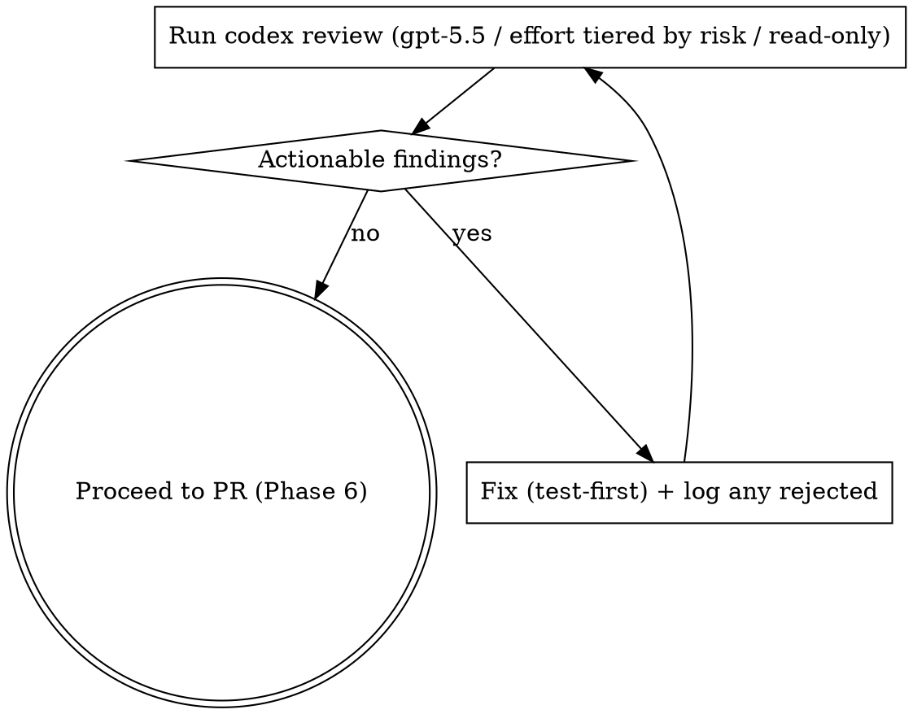
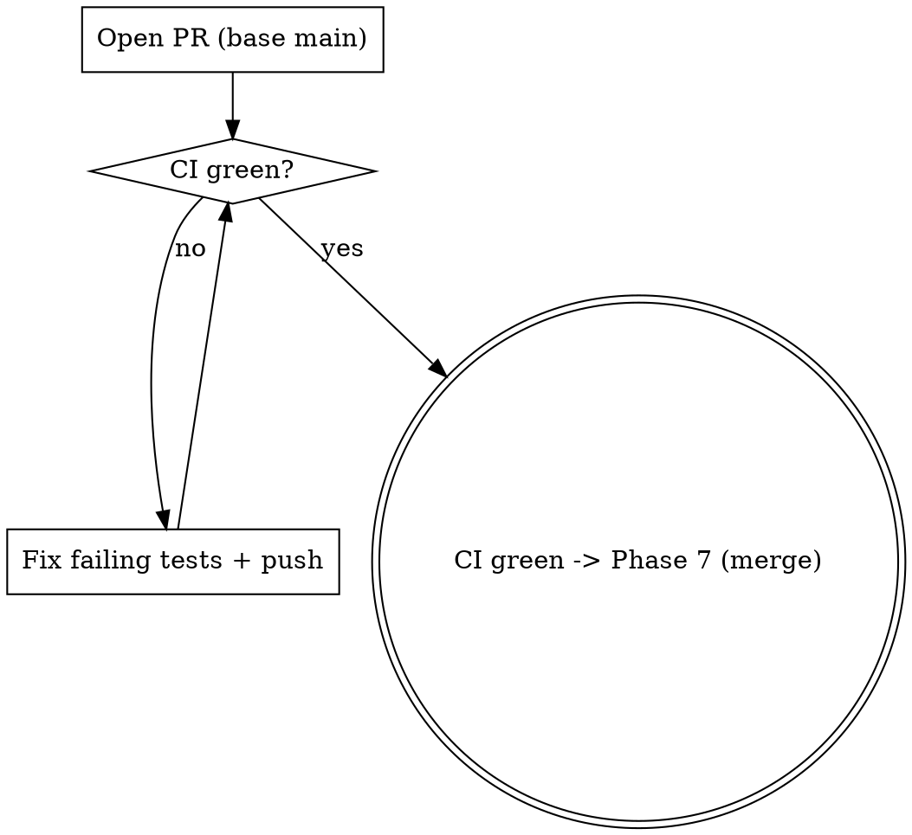

# yolo-ship — implement a task end-to-end (autonomously)

## Overview

One task → one worktree → phases (**brainstorm → design → implement → codex-review → ship**). The heavy work (codebase reads, per-task implementation) is pushed to **subagents** so your own context stays lean. You make and **document** decisions instead of asking the user. Before the PR ever opens you review the whole branch locally with Codex (`gpt-5.5` at `xhigh` reasoning effort) and address its findings; then you open the PR and you are not done until it is **CI-green**.

This skill orchestrates other skills. It does not re-explain them — it sequences them and adds the autonomy contract + the ship loop.

## The autonomy contract (hard rules)

1. **Don't ask the user.** Make a recommendation and proceed. Escalate via `AskUserQuestion` ONLY when a decision is high-stakes **and** ambiguous **and** not inferable from code, memory, or conventions. "I want to be safe" is not a reason to ask — it's a reason to document.
2. **Every non-trivial decision is logged** to `.claude/memory/decisions.md` (Date | Decision | Rationale | Alternatives). If you'd have asked the user, write the recommendation there instead.
3. **Follow-up work is tracked, never silently dropped.** Anything you deliberately defer becomes a card on the **"TO DO"** project board (To Do, or Backlog if it's gated) — not a memory. **Orchestrated mode:** don't touch the board's **routing** (`Status`, `Depends on`) or other cards — auto-ship owns those; return follow-ups in your handoff so auto-ship creates the cards. The one thing you *do* write is the **progress block of your own card** (see Progress reporting).
4. **Pre-PR gate is `pnpm build` + `pnpm test` + lint** — not just build+test (see [[feedback_run_lint_before_pr]], [[feedback_run_tsc_alongside_vitest]]).
5. **Done = branch codex-reviewed clean *before* the PR + CI green, then merged.** The review runs locally with Codex (`gpt-5.5` / `xhigh` effort, read-only) before the PR exists — there is **no hosted-reviewer wait**. When CI is green you **auto-merge** (Phase 7) and fast-forward local `main`. **Exception — orchestrated mode:** if auto-ship dispatched you, do **NOT** merge and do **NOT** touch the board — stop at a green, verified-mergeable PR and return the handoff; auto-ship owns the serialized merge queue and all board writes.

## Context budget (target < 300–400K tokens)

The orchestrator (you) holds only: the plan file, project memory, and one-paragraph summaries from each subagent. Never the raw file dumps.

- **Codebase exploration** → dispatch the `Explore` subagent. It returns conclusions, not file contents.
- **Per-task implementation** → dispatch one subagent per plan task (subagent-driven-development). Each returns a short summary of what it changed + test status. ~50–100× context savings vs. doing it inline.
- If your context climbs past ~250K, flush state to the plan file + memory and keep leaning on them. Don't try to hold everything.

## Progress reporting (live on the board)

When this task has a board card, post a **one-line heartbeat to its progress block at
each phase boundary**, so a watching human can manage the work and spot exceptions
straight from the board. It's the same delimited-block + `append_progress` helper
documented in `.claude/skills/auto-ship/references/github-project.md` §6.

- **Orchestrated** (auto-ship dispatched you): the card always exists. Its item id
  (`<ITEM-ID>`) and the helper's absolute path arrive in your dispatch prompt. Write
  in a SINGLE Bash call each time (shell state doesn't persist across calls):
  `source <PATH> && append_progress "<ITEM-ID>" "<line>"`.
- **Standalone** (`/yolo-ship` run directly): resolve the card by its `[TASK-ID]`
  prefix (`gh project item-list 1 --owner project-ax --format json | jq …`, filtered
  in-shell to the item id). If no card exists or `gh` lacks the `project` scope,
  **silently skip** all progress writes — a standalone run without a card stays
  board-free. If a card exists, copy the `append_progress` snippet from §6 into a temp
  script in your worktree and source it.

**Rules:** *best-effort* — a failed progress write must **never** abort the ship.
*Shell-side* — the helper does the read-modify-write in shell; never read the card
body into your context (it grows every line). *Own card only* — append to your own
card; never touch `Status` or `Depends on` (auto-ship owns routing).

Per-phase line catalogue (prefix exceptions with `⚠`):

| Phase | Line(s) |
|---|---|
| 1 Brainstorm | `brainstorm done — approach: <phrase>` |
| 2 Design | `plan written — <N> tasks` |
| 3 Implement | per task `task <k>/<N> done — <slug>`; trouble `⚠ task <k>/<N> blocked — <why>` |
| 4 Gate | `build+test+lint green` or `⚠ gate red — <tool/suite>` |
| 5 Codex | `⚠ codex flagged <M> — addressing` → `codex review clean` |
| 6 Ship | `PR #<n> opened`; `⚠ CI red — <suite>`; `CI green ✅` |
| 7 Merge | standalone only: `merged #<n> ✅` (orchestrated: auto-ship writes this) |

## The phases

### Phase 0 — Isolate
- **REQUIRED:** Use superpowers:using-git-worktrees (or the `EnterWorktree` tool) to create a fresh worktree + branch for this task. All work happens there.
- **REQUIRED:** Use claude-memory — read `.claude/memory/` so prior decisions/mistakes/patterns inform the work.

### Phase 1 — Brainstorm (run it autonomously)
- **REQUIRED:** Use superpowers:brainstorming — but in self-answering mode. Generate the questions it would ask the user, then answer each one yourself from the codebase, `.claude/memory/`, CLAUDE.md, and architecture docs. Log each material answer to `decisions.md`.
- Use `Explore` subagents for any "how does X currently work?" question so the exploration doesn't bloat your context.
- Output: a tight problem statement + chosen approach (a few paragraphs), not a transcript.
- **Progress:** `brainstorm done — approach: <phrase>` (see Progress reporting).

### Phase 2 — Design
- **REQUIRED:** Use superpowers:writing-plans — produce a written plan broken into **independent, testable tasks**. Save it to a file (e.g. `docs/plans/<date>-<slug>.md` or the worktree root).
- **REQUIRED for AX code:** Use ax-conventions — honor the six invariants; do the boundary-review checklist for any new/changed hook.
- Apply a YAGNI pass ([[feedback_yagni_check_in_plans]]): mark each task "load-bearing at MVP or dead code?" — cut the dead.
- If the task touches a sandbox boundary, IPC, plugin loading, untrusted content, or new dependencies, note that Phase 3 must run security-checklist.
- **Progress:** `plan written — <N> tasks`.

### Phase 3 — Implement (subagent-driven)
- **REQUIRED:** Use superpowers:subagent-driven-development — dispatch one subagent per plan task. Each subagent uses superpowers:test-driven-development (test first) and returns a summary. **Tier the subagent's model to the task** (its model-selection guidance): the cheapest/fastest model for mechanical 1–2 file tasks with a clear spec, a standard model for multi-file integration, the most capable only for design/judgment. Don't run every mechanical task on the top model.
- After each task, review the returned diff against the plan (superpowers:requesting-code-review / receiving-code-review). Don't rubber-stamp; verify claims.
- New hook surface or sensitive boundary touched → run security-checklist before moving on.
- **Progress:** after each task, `task <k>/<N> done — <slug>` (trouble: `⚠ task <k>/<N> blocked — <why>`).

### Phase 4 — Pre-PR gate
- **REQUIRED:** Use superpowers:verification-before-completion — run the real commands, read the real output. Evidence before claims.
- Run `pnpm build && pnpm test` (or `--filter @ax/<plugin>`) **and** lint. tsc must be clean, not just vitest ([[feedback_run_tsc_alongside_vitest]]).
- Do a **whole-branch** review, not just per-task — a shared-table FK or repo-wide teardown break only shows on the full build ([[feedback_new_fk_breaks_downstream_test_teardown]]).
- Track every deferred item as a card on the **"TO DO"** board (To Do, or Backlog if gated) — or, in orchestrated mode, return it in your handoff for auto-ship to file.
- **Progress:** `build+test+lint green` (or `⚠ gate red — <tool/suite>`).

### Phase 5 — Local Codex review (before the PR exists)
This replaces waiting on a hosted reviewer. Review the **whole branch** locally with Codex *before* any PR is opened, and address findings in a loop until the review is clean.



- **REQUIRED:** Use skill-codex:codex to drive the review — but in **fixed-config, autonomous mode**. The codex skill normally asks the user (via `AskUserQuestion`) which model + reasoning effort to use and for permission to pass `--skip-git-repo-check`; under the autonomy contract you do **NOT** ask. Pin the config and pre-authorize the flag:
  - model: **`gpt-5.5`**, sandbox: **`read-only`** (this is a review pass, not an edit pass)
  - **reasoning effort — tier it to the diff's risk** (effort is the cost knob; don't pay `xhigh` for a one-liner):
    - **`xhigh`** — diff touches a sandbox boundary, IPC transport, plugin loading/manifests, untrusted-input handling, a hook surface, DB schema/migrations, capabilities, or spans many packages (the invariant-5 / boundary-review surfaces).
    - **`high`** — ordinary single-concern code change with no boundary/security surface.
    - **skip Codex entirely** — docs/comment/config-only or other non-code diffs; the PR's CodeRabbit + CodeQL + semgrep + gitleaks already cover those. Log the skip in `decisions.md`.
    - When unsure, round **up** a tier.
- Run it from the worktree (cwd = the branch under review). Point Codex at the **whole-branch diff against `main`** — the same surface CI and a human reviewer would see, not just the last task:
  ```bash
  # $EFFORT = xhigh | high, chosen per the risk tier above
  codex exec --skip-git-repo-check -m gpt-5.5 \
    --config model_reasoning_effort="$EFFORT" \
    --sandbox read-only \
    "Act as a critical code reviewer. Review the changes on this branch: run \`git diff main...HEAD\` (merge-base diff) and inspect the touched files. Flag, by severity with file:line: correctness bugs, security issues (sandbox/IPC/untrusted-input boundaries, capability over-grant), silent failures / swallowed errors, missing regression tests for bug fixes, and AX-convention/invariant violations. Be specific. Do not rubber-stamp; if you find nothing, say why the diff is sound." 2>/dev/null
  ```
- **Address findings with receiving-code-review discipline** — verify each one; fix the real issues with targeted commits (test-first for bugs, per Bug Fix Policy [[feedback_targeted_followup_commits]]), and log in `decisions.md` any finding you deliberately reject and why (silent dismissal isn't allowed). Then **re-run the review** until it returns no actionable findings — either a fresh `codex exec` or resume to keep its context:
  ```bash
  echo "I pushed fixes for those. Re-review the current branch diff against main and confirm the findings are resolved or list what remains." | codex exec --skip-git-repo-check resume --last 2>/dev/null
  ```
- Codex is a **colleague, not an authority** — treat its claims critically: push back on wrong ones (model names, recent APIs, anything you can verify) rather than blindly deferring.
- Only when the codex review is clean do you proceed to Phase 6 and open the PR.
- **Progress:** `⚠ codex flagged <M> — addressing` when you start fixing, then `codex review clean` once the loop closes.

### Phase 6 — Ship: open the PR + drive CI green
The branch is already codex-reviewed and clean, so there is **no hosted-reviewer wait** here. Open the PR and take CI to green.



- **Open the PR against `main`:** use commit-commands:commit-push-pr (or superpowers:finishing-a-development-branch → PR option). Pass `--base main` explicitly; don't stack onto a feature branch. Boundary review answers belong in the PR body if hooks changed.
- **CI:** `gh pr checks <n>`. On red, use superpowers:systematic-debugging — fix the root cause, add a regression test (Bug Fix Policy), commit granularly ([[feedback_targeted_followup_commits]]) and push. While waiting on CI, do **not** busy-spin in context — poll with short sleeps (~270s, keeps the prompt cache warm) or use `ScheduleWakeup` (~600s+) and let the run resume.
- A push that changes the diff materially invalidates the earlier codex review — if you fix more than a trivial test flake, re-run the Phase 5 review on the new diff before declaring done.
- **When CI is green, proceed to Phase 7** (auto-merge standalone, or hand off under orchestration). Do not declare done at a green PR — merging (or handing off) is the terminal step now.
- **Progress:** `PR #<n> opened` on open; `⚠ CI red — <suite>` on red; `CI green ✅` when green.

### Phase 7 — Merge: auto-merge (standalone) or hand off (orchestrated)

How this phase behaves depends on **mode**:

- **Standalone** (a human ran `/yolo-ship` directly) — **default: auto-merge.**
- **Orchestrated** (auto-ship dispatched you — the dispatch prompt says so) — **do
  NOT merge, do NOT touch the board.** Stop at the green, verified-mergeable PR
  and return your handoff. auto-ship's serialized merge queue does the merge +
  local-main update + board move (→ Done). This is how auto-ship safely serializes
  many parallel agents.

**Standalone auto-merge:**

```bash
gh pr view <n> --json mergeable,statusCheckRollup    # must be green + mergeable
gh pr merge <n> --squash --delete-branch
git checkout main && git pull --ff-only
```

If the PR is **not mergeable** because `main` moved while you worked: check out
the branch, `git rebase origin/main`, resolve conflicts, push, wait for CI to
re-green (`gh pr checks <n>`), then merge. A non-trivial rebase changes the diff —
re-run the Phase 5 Codex review on the new diff before merging.

After merging: move the task's card → **Done** on the "TO DO" board and
`append_progress … "merged #<n> ✅"` on it (the progress-block heartbeat; see Progress
reporting), then report the merge. Then you are done.

## Red flags — you are rationalizing

| Thought | Reality |
|---|---|
| "I'll ask the user to be safe" | Document a recommendation in `decisions.md` and proceed. Asking is the exception, not the default. |
| "I'll skip lint, build+test passed" | The gate is build+test+**lint**. tsc/lint catch what vitest tolerates. |
| "I'll defer this but it's obvious" | Obvious-to-you ≠ tracked. File a board card (or hand it off) or it's lost. |
| "CI will probably pass, I'll wrap up" | Not done until `gh pr checks` is actually green. Verify, don't assume. |
| "I'll skip the codex review, lint+test passed" | The pre-PR gate now *includes* a Codex review. Tests prove behavior; the review catches design/security/convention issues tests don't. |
| "I'll ask the user which model for codex" | yolo-ship pins `gpt-5.5` read-only and tiers the *effort* by risk (xhigh for boundary/security/schema/multi-file, high ordinary, skip docs). Don't fall through to skill-codex's interactive `AskUserQuestion` — that breaks the autonomy contract. |
| "Small change, but I'll run xhigh + the full local suite to be safe" | Tier it. `xhigh` + full ceremony on a one-liner is the waste we're cutting; reserve the heavy path for boundary/security/schema/multi-file diffs. |
| "Codex flagged it but I think it's fine" | Verify each finding (receiving-code-review). Fix real ones; log rejected ones in `decisions.md` with the reason. Silent dismissal isn't allowed. |
| "I'll review locally after I open the PR" | The review is the gate *before* the PR. Open it only once Codex is clean. |
| "auto-ship dispatched me but I'll merge anyway" | Orchestrated mode = stop at a green PR + hand off. Self-merging races the other agents and corrupts the serialized queue. |
| "I'll implement inline, subagents are overhead" | Inline implementation blows the context budget. Dispatch per task. |
| "This decision is too small to log" | If you'd have asked the user about it, it's big enough to log. |

## Quick reference — what this orchestrates

| Phase | Skill / tool |
|---|---|
| Isolate | superpowers:using-git-worktrees, `EnterWorktree`, claude-memory |
| Brainstorm | superpowers:brainstorming, `Explore` subagent |
| Design | superpowers:writing-plans, ax-conventions, security-checklist |
| Implement | superpowers:subagent-driven-development, superpowers:test-driven-development |
| Verify | superpowers:verification-before-completion, superpowers:requesting-code-review |
| Codex review (pre-PR) | skill-codex:codex (`gpt-5.5` / `xhigh` / read-only), superpowers:receiving-code-review |
| Ship | commit-commands:commit-push-pr, superpowers:systematic-debugging, `gh`, `ScheduleWakeup` |
| Merge (Phase 7) | `gh pr merge --squash`, `git pull --ff-only` (standalone); hand off to auto-ship (orchestrated) |
| Progress (every phase) | `append_progress` heartbeat to the card's progress block — auto-ship `references/github-project.md` §6; best-effort, shell-side, own card only |
