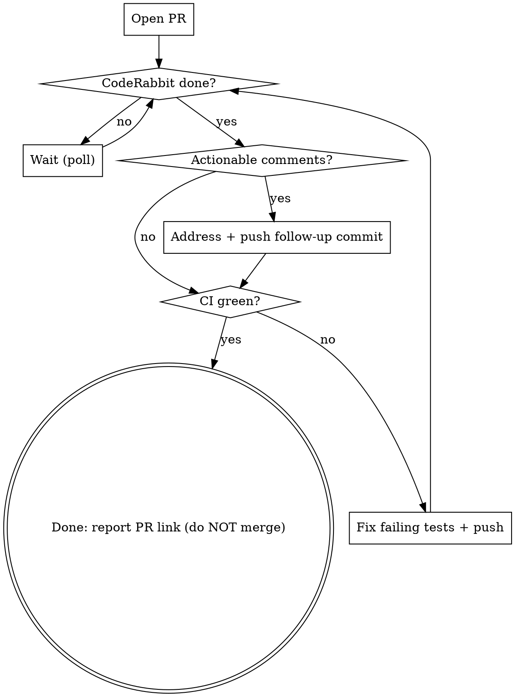

# yolo-ship — implement a task end-to-end (autonomously)

## Overview

One task → one worktree → four phases (**brainstorm → design → implement → ship**). The heavy work (codebase reads, per-task implementation) is pushed to **subagents** so your own context stays lean. You make and **document** decisions instead of asking the user. You are not done until the PR is **CI-green and review-clean** — you wait for CodeRabbit, address it, and fix failing tests in a loop.

This skill orchestrates other skills. It does not re-explain them — it sequences them and adds the autonomy contract + the ship loop.

## The autonomy contract (hard rules)

1. **Don't ask the user.** Make a recommendation and proceed. Escalate via `AskUserQuestion` ONLY when a decision is high-stakes **and** ambiguous **and** not inferable from code, memory, or conventions. "I want to be safe" is not a reason to ask — it's a reason to document.
2. **Every non-trivial decision is logged** to `.claude/memory/decisions.md` (Date | Decision | Rationale | Alternatives). If you'd have asked the user, write the recommendation there instead.
3. **Follow-up work goes in `TODO.md`** — never silently dropped. Anything you deliberately defer is a TODO line, not a memory.
4. **Pre-PR gate is `pnpm build` + `pnpm test` + lint** — not just build+test (see [[feedback_run_lint_before_pr]], [[feedback_run_tsc_alongside_vitest]]).
5. **Done = CI green + CodeRabbit comments addressed + no new actionable comments.** You do **NOT** merge. Stop at a green, review-clean PR and report the link.

## Context budget (target < 300–400K tokens)

The orchestrator (you) holds only: the plan file, project memory, and one-paragraph summaries from each subagent. Never the raw file dumps.

- **Codebase exploration** → dispatch the `Explore` subagent. It returns conclusions, not file contents.
- **Per-task implementation** → dispatch one subagent per plan task (subagent-driven-development). Each returns a short summary of what it changed + test status. ~50–100× context savings vs. doing it inline.
- If your context climbs past ~250K, flush state to the plan file + memory and keep leaning on them. Don't try to hold everything.

## The phases

### Phase 0 — Isolate
- **REQUIRED:** Use superpowers:using-git-worktrees (or the `EnterWorktree` tool) to create a fresh worktree + branch for this task. All work happens there.
- **REQUIRED:** Use claude-memory — read `.claude/memory/` so prior decisions/mistakes/patterns inform the work.

### Phase 1 — Brainstorm (run it autonomously)
- **REQUIRED:** Use superpowers:brainstorming — but in self-answering mode. Generate the questions it would ask the user, then answer each one yourself from the codebase, `.claude/memory/`, CLAUDE.md, and architecture docs. Log each material answer to `decisions.md`.
- Use `Explore` subagents for any "how does X currently work?" question so the exploration doesn't bloat your context.
- Output: a tight problem statement + chosen approach (a few paragraphs), not a transcript.

### Phase 2 — Design
- **REQUIRED:** Use superpowers:writing-plans — produce a written plan broken into **independent, testable tasks**. Save it to a file (e.g. `docs/plans/<date>-<slug>.md` or the worktree root).
- **REQUIRED for AX code:** Use ax-conventions — honor the six invariants; do the boundary-review checklist for any new/changed hook.
- Apply a YAGNI pass ([[feedback_yagni_check_in_plans]]): mark each task "load-bearing at MVP or dead code?" — cut the dead.
- If the task touches a sandbox boundary, IPC, plugin loading, untrusted content, or new dependencies, note that Phase 3 must run security-checklist.

### Phase 3 — Implement (subagent-driven)
- **REQUIRED:** Use superpowers:subagent-driven-development — dispatch one subagent per plan task. Each subagent uses superpowers:test-driven-development (test first) and returns a summary.
- After each task, review the returned diff against the plan (superpowers:requesting-code-review / receiving-code-review). Don't rubber-stamp; verify claims.
- New hook surface or sensitive boundary touched → run security-checklist before moving on.

### Phase 4 — Pre-PR gate
- **REQUIRED:** Use superpowers:verification-before-completion — run the real commands, read the real output. Evidence before claims.
- Run `pnpm build && pnpm test` (or `--filter @ax/<plugin>`) **and** lint. tsc must be clean, not just vitest ([[feedback_run_tsc_alongside_vitest]]).
- Do a **whole-branch** review, not just per-task — a shared-table FK or repo-wide teardown break only shows on the full build ([[feedback_new_fk_breaks_downstream_test_teardown]]).
- Write every deferred item into `TODO.md`.

### Phase 5 — Ship: PR + CodeRabbit + CI loop
This is where you must not stop early. Follow the loop below until both conditions are green.



- **Open the PR against `main`:** use commit-commands:commit-push-pr (or superpowers:finishing-a-development-branch → PR option). **CodeRabbit only reviews PRs whose base is `main`** — target any other branch and it never reviews. Pass `--base main` explicitly; don't stack onto a feature branch. Boundary review answers belong in the PR body if hooks changed.
- **Wait for CodeRabbit** (`coderabbitai[bot]`). It first posts a "Currently reviewing…" placeholder, then edits in the real review (usually a few minutes). Detect completion:
  ```bash
  gh pr view <n> --json reviews,comments \
    --jq '[.reviews[],.comments[]] | map(select(.author.login=="coderabbitai")) | last | .body' \
    | grep -qiv "currently reviewing\|review in progress"
  ```
  While waiting, do **not** busy-spin in context. Either poll with short sleeps (~270s, keeps the prompt cache warm) or use `ScheduleWakeup` (~600s+) and let the run resume.
- **Mind the review budget.** CodeRabbit rate-limits reviews (~3–5 per hour, refilling over time) and **re-reviews on every push** — each push spends one review. The remaining count + refill ETA appear at the bottom of every review walkthrough (e.g. "2/5 reviews remaining, refill in 42 minutes"). Check quota **without** spending a review by commenting `@coderabbitai reviews remaining?` (or `@coderabbitai rate limit`). Read the budget before you push.
- **Batch fixes; push once per cycle.** Address *all* outstanding CodeRabbit comments **and** all CI/test failures, commit them granularly (targeted follow-up commits, not amend — [[feedback_targeted_followup_commits]]), then push the batch in a single shot so CodeRabbit consumes one review, not one per comment. If the budget is exhausted, `ScheduleWakeup` for the stated refill window and push then — pushing into a rate-limited void just skips the review.
- **Address comments** with receiving-code-review discipline — verify each suggestion; push back in the PR thread on ones that are wrong, fix the rest. Minor + "ready to merge" means ship ([[feedback_minor_issues_non_blocking]]).
- **CI:** `gh pr checks <n>`. On red, use superpowers:systematic-debugging — fix the root cause, add a regression test (Bug Fix Policy). Fold the fix into the same batched push above.
- After each batched push, re-check CodeRabbit (it re-reviews the new commits) and CI. **Exit only when CI is green AND no unaddressed actionable CodeRabbit comments remain.** Then report the PR link and stop.

## Red flags — you are rationalizing

| Thought | Reality |
|---|---|
| "I'll ask the user to be safe" | Document a recommendation in `decisions.md` and proceed. Asking is the exception, not the default. |
| "I'll skip lint, build+test passed" | The gate is build+test+**lint**. tsc/lint catch what vitest tolerates. |
| "I'll defer this but it's obvious" | Obvious-to-you ≠ tracked. Put it in `TODO.md` or it's lost. |
| "CI will probably pass, I'll wrap up" | Not done until `gh pr checks` is actually green. Verify, don't assume. |
| "CodeRabbit is slow, I'll skip waiting" | Waiting for the review is the task. Poll/Schedule and come back. |
| "I'll push each fix as I make it" | CodeRabbit re-reviews every push and caps at ~3–5/hr. Batch fixes, push once per cycle, check `@coderabbitai reviews remaining?` first. |
| "I'll base this PR on my other branch" | CodeRabbit only reviews PRs against `main`. Any other base = no review. |
| "I'll implement inline, subagents are overhead" | Inline implementation blows the context budget. Dispatch per task. |
| "This decision is too small to log" | If you'd have asked the user about it, it's big enough to log. |

## Quick reference — what this orchestrates

| Phase | Skill / tool |
|---|---|
| Isolate | superpowers:using-git-worktrees, `EnterWorktree`, claude-memory |
| Brainstorm | superpowers:brainstorming, `Explore` subagent |
| Design | superpowers:writing-plans, ax-conventions, security-checklist |
| Implement | superpowers:subagent-driven-development, superpowers:test-driven-development |
| Verify | superpowers:verification-before-completion, superpowers:requesting-code-review |
| Ship | commit-commands:commit-push-pr, superpowers:receiving-code-review, superpowers:systematic-debugging, `gh`, `ScheduleWakeup` |
