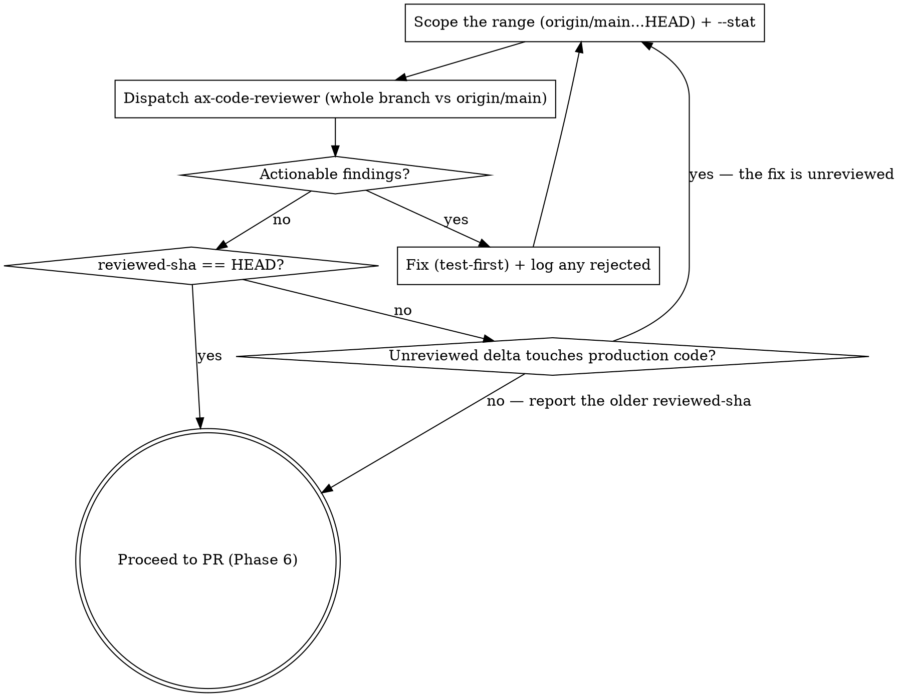
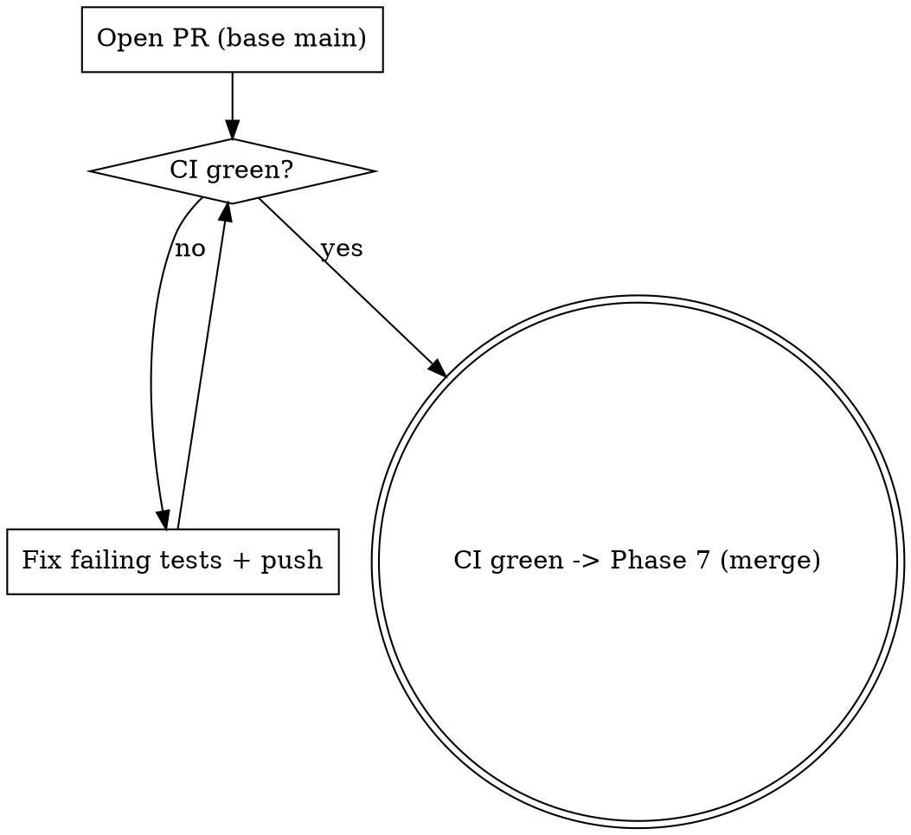

# yolo-ship — implement a task end-to-end (autonomously)

## Overview

One task → one worktree → phases (**brainstorm → design → implement → review → ship**). The heavy work (codebase reads, per-task implementation) is pushed to **subagents** so your own context stays lean. You make and **document** decisions instead of asking the user. Before the PR ever opens you review the whole branch locally with the **`ax-code-reviewer`** subagent (Opus 4.8, max effort) and address its findings; then you open the PR and you are not done until it is **CI-green**.

This skill orchestrates other skills. It does not re-explain them — it sequences them and adds the autonomy contract + the ship loop.

## The autonomy contract (hard rules)

1. **Don't ask the user.** Make a recommendation and proceed. Escalate via `AskUserQuestion` ONLY when a decision is high-stakes **and** ambiguous **and** not inferable from code, memory, or conventions. "I want to be safe" is not a reason to ask — it's a reason to document.
2. **Every non-trivial decision is logged** to your task's **decisions shard** (Date | Decision | Rationale | Alternatives). Get the path from `scripts/memory-write-target.sh --shard decisions <TASK-ID>` — it prints `.claude/memory/decisions/<YYYY-MM-DD>-<TASK-ID>.md` and creates nothing, so `mkdir -p "$(dirname "$path")"` first. **Never append to the root `.claude/memory/decisions.md` archive:** while every branch appended there, eight branches hit an append-collision in one day's runs — each one a rebase, a force-push and a fresh ~10-minute CI run. `scripts/memory-append-check.sh` runs in CI and fails the PR if an archive is touched or any memory line is deleted. If you'd have asked the user, write the recommendation in the shard instead.
3. **Follow-up work is tracked, never silently dropped.** Anything you deliberately defer becomes a card on the **"TO DO"** project board (To Do, or Backlog if it's gated) — not a memory. **Orchestrated mode:** don't touch the board's **routing** (`Status`, `Depends on`) or other cards — auto-ship owns those; return follow-ups in your handoff so auto-ship creates the cards. The one thing you *do* write is the **progress block of your own card** (see Progress reporting). Likewise, **surface what you learned that changes assumptions for *other* tasks** — a changed interface, an established pattern, a decision, a gotcha, or a sibling card whose premise your work invalidated — in the handoff's `learnings:` field (and commit durable ones to `.claude/memory/`); auto-ship feeds them forward to the still-queued same-epic cards (auto-ship › Forward learning).
4. **Pre-PR gate is `pnpm build` + `pnpm test` + lint** — not just build+test (see [[feedback_run_lint_before_pr]], [[feedback_run_tsc_alongside_vitest]]).
5. **If a stale doc or memory line generated this card, fixing that line is part of the card.** Not a follow-up, not a nice-to-have — it ships in the same PR. Measured: three cards in one session were filed from a stale `.claude/memory/` line rather than from the code, and one of them ([[feedback_dont_conflate_generic_infra]]'s sibling, TASK-241) would have **deleted a live hook** on the strength of a prose claim that had been false for a day. Fixing the code and leaving the line means a later session re-files the same card off the same sentence. Ask it explicitly at Phase 2: *what did I read that made this card look true?* If the answer is a doc, a comment, or a memory row, correct it here. And **grep the prose spellings too**, not just the symbol — a false comment hid as "the old tool-group" after `ToolGroup` was deleted.
6. **Done = branch reviewed clean *before* the PR + CI green, then merged.** The review runs locally via the `ax-code-reviewer` subagent before the PR exists — there is **no hosted-reviewer wait**. That subagent **can hang without returning**; when it does, say so (`reviewer: hung`) and let the fallback run — never self-review and report it as clean (Phase 5, deadline protocol). When CI is green you **auto-merge** (Phase 7) and fast-forward local `main`. **Exception — orchestrated mode:** if auto-ship dispatched you, do **NOT** merge and do **NOT** touch the board — stop at a green, verified-mergeable PR and return the handoff; auto-ship owns the serialized merge queue and all board writes.

## Context budget (target < 300–400K tokens)

The orchestrator (you) holds only: the plan file, project memory, and one-paragraph summaries from each subagent. Never the raw file dumps.

- **Codebase exploration** → dispatch the `Explore` subagent. It returns conclusions, not file contents.
- **Per-task implementation** → dispatch one subagent per plan task (subagent-driven-development). Each returns a short summary of what it changed + test status. ~50–100× context savings vs. doing it inline.
- If your context climbs past ~250K, flush state to the plan file + memory and keep leaning on them. Don't try to hold everything.

## Progress reporting (live on the board)

When this task has a board card, post a **one-line heartbeat to its progress block at
each phase boundary**, so a watching human can manage the work and spot exceptions
straight from the board. It's the same delimited-block + `append_progress` helper
documented in `.claude/skills/auto-ship/references/github-project.md` §6.

- **Orchestrated** (auto-ship dispatched you): the card always exists. Its item id
  (`<ITEM-ID>`) and the **absolute path to `.claude/auto-ship-hb.sh`** arrive in your
  dispatch prompt. **CALL the wrapper; do NOT `source` anything:**
  `<ABS-PATH>/.claude/auto-ship-hb.sh "<ITEM-ID>" "<line>"` — one Bash call each time.
  The raw helper is **gitignored**, so `git worktree add` does not carry it into your
  worktree; a relative `source .claude/auto-ship-progress.sh` copied from the
  orchestrator-side examples exits **127** and your heartbeat is dead for the whole
  run. Do not hand-roll a copy of the helper inside your worktree either — two
  builders independently did exactly that, which is why the wrapper exists.
- **Standalone** (`/yolo-ship` run directly): resolve the card by its `[TASK-ID]`
  prefix (`gh project item-list 1 --owner project-ax --format json | jq …`, filtered
  in-shell to the item id). If no card exists or `gh` lacks the `project` scope,
  **silently skip** all progress writes — a standalone run without a card stays
  board-free. If a card exists, copy the `append_progress` snippet from §6 into a temp
  script in your worktree and source it.

**Rules:** *best-effort but never silent* — a failed progress write must **never**
abort the ship, and must **never** pass unreported either. The wrapper prints
`HEARTBEAT-FAILED(setup)` for a broken installation (it will fail all run — say so),
`HEARTBEAT-FAILED(caller)` for a malformed item id (your argument is wrong — no
retry helps), and `HEARTBEAT-FAILED(transient)` for a rate-limited or blipped
write. Report the outcome in the **required** `progress:` handoff field — `live`, or
`FAILED-<setup|caller|refused|transient>`. Nothing machine-reads the progress block, so if you do not
report it, nobody learns the heartbeat was dead until the run is over. It is not a
merge blocker.
*Shell-side* — the helper does the read-modify-write in shell; never read the card
body into your context (it grows every line). *Own card only* — append to your own
card; never touch `Status` or `Depends on` (auto-ship owns routing). *Budget-frugal* —
each write is a GraphQL read+write and the org-wide GraphQL budget (5000 pts/hr) is
shared across every concurrent agent + the orchestrator; post **only at the catalogued
phase boundaries below** (plus `⚠` exceptions), never a finer-grained running
commentary — extra heartbeats burn shared budget that the merge queue needs.

Per-phase line catalogue (prefix exceptions with `⚠`):

| Phase | Line(s) |
|---|---|
| 1 Brainstorm | `brainstorm done — approach: <phrase>` |
| 2 Design | `plan written — <N> tasks` |
| 3 Implement | per task `task <k>/<N> done — <slug>`; trouble `⚠ task <k>/<N> blocked — <why>` |
| 4 Gate | `build+test+lint green` or `⚠ gate red — <tool/suite>` |
| 5 Review | `⚠ review flagged <M> — addressing` → `review clean`; on a hang `⚠ reviewer hung — re-dispatching`, then `⚠ reviewer hung ×2 — <fallback>` |
| 6 Ship | `PR #<n> opened`; `⚠ CI red — <suite>`; `CI green ✅` |
| 7 Merge | standalone only: `merged #<n> ✅` (orchestrated: auto-ship writes this) |

## The phases

### Phase 0 — Isolate
- **REQUIRED — one worktree per task, NEVER the main checkout.** All work happens in a
  dedicated git worktree, never the primary checkout. Concurrent agents that
  `git checkout -b` in the shared main checkout clobber each other's HEAD, working
  tree, and `.claude/memory` writes (the ARCH-2 incident: a second agent observed
  "HEAD there is on ARCH-2's branch" in the main checkout).
  - **Orchestrated with `isolation: "worktree"`** (how auto-ship dispatches you): you
    already start in your own isolated worktree — confirm it, then create your branch
    there: `git switch -c auto-ship/<TASK-ID>-<slug>`.
  - **Otherwise:** create one with superpowers:using-git-worktrees / the `EnterWorktree`
    tool at `.claude/worktrees/<TASK-ID>` (inside the repo, gitignored) and `cd` into it.
  - **Guard before the first commit:** `git rev-parse --show-toplevel` MUST NOT be the
    primary checkout root. If it is, STOP and make the worktree — never `git checkout -b`,
    commit, or `git switch` in the main checkout under any circumstance.
- **REQUIRED:** Use claude-memory — read `.claude/memory/`, both the root archives and the
  `<kind>/` shards (the shards hold everything recent), so prior decisions/mistakes/patterns
  inform the work. Write new rows as shards, and commit memory updates to YOUR
  worktree/branch copy only, never the main checkout (TASK-7 convention;
  `scripts/memory-write-target.sh` resolves the right dir).

### Phase 1 — Brainstorm (run it autonomously)
- **REQUIRED:** Use superpowers:brainstorming — but in self-answering mode. Generate the questions it would ask the user, then answer each one yourself from the codebase, `.claude/memory/`, CLAUDE.md, and architecture docs. Log each material answer to your decisions shard (rule 2).
- **Predecessor learnings (orchestrated / epic cards):** if your card body carries a `Predecessor learnings` block — lessons from same-epic cards merged before you — read it first and fold it into your approach. If a learning **invalidates this card's premise** (the design was built differently than this card assumed), don't guess: return `outcome: blocked` with the scope question so auto-ship routes it to Needs Input. If the card body cites a `design:` doc, read that for the full picture.
- Use `Explore` subagents for any "how does X currently work?" question so the exploration doesn't bloat your context.
- Output: a tight problem statement + chosen approach (a few paragraphs), not a transcript.
- **Progress:** `brainstorm done — approach: <phrase>` (see Progress reporting).

### Phase 2 — Design
- **REQUIRED:** Use superpowers:writing-plans — produce a written plan broken into **independent, testable tasks**. Save it to a file (e.g. `docs/plans/<date>-<slug>.md` or the worktree root).
- **REQUIRED for AX code:** Use ax-conventions — honor the six invariants; do the boundary-review checklist for any new/changed hook.
- Apply a YAGNI pass ([[feedback_yagni_check_in_plans]]): mark each task "load-bearing at MVP or dead code?" — cut the dead.
- If the task touches a sandbox boundary, IPC, plugin loading, untrusted content, or new dependencies, note that Phase 3 must run security-checklist.
- **Progress:** `plan written — <N> tasks`.

### Phase 3 — Implement (subagent-driven)
- **REQUIRED:** Use superpowers:subagent-driven-development — dispatch one subagent per plan task. Each subagent uses superpowers:test-driven-development (test first) and returns a summary. **Tier the subagent's model to the task** (its model-selection guidance): the cheapest/fastest model for mechanical 1–2 file tasks with a clear spec, a standard model for multi-file integration, the most capable only for design/judgment. Don't run every mechanical task on the top model.
- After each task, review the returned diff against the plan (superpowers:requesting-code-review / receiving-code-review). Don't rubber-stamp; verify claims.
- New hook surface or sensitive boundary touched → run security-checklist before moving on.
- **Progress:** after each task, `task <k>/<N> done — <slug>` (trouble: `⚠ task <k>/<N> blocked — <why>`).

### Phase 4 — Pre-PR gate
- **REQUIRED:** Use superpowers:verification-before-completion — run the real commands, read the real output. Evidence before claims.
- Run `pnpm build && pnpm test` (or `--filter @ax/<plugin>`) **and** lint. tsc must be clean, not just vitest ([[feedback_run_tsc_alongside_vitest]]).
- Do a **whole-branch** review, not just per-task — a shared-table FK or repo-wide teardown break only shows on the full build ([[feedback_new_fk_breaks_downstream_test_teardown]]).
- Track every deferred item as a card on the **"TO DO"** board (To Do, or Backlog if gated) — or, in orchestrated mode, return it in your handoff for auto-ship to file.
- **Did a stale line generate this card?** If so it is fixed in this branch (contract rule 5) — verify it is actually in the diff before the gate passes.
- **Progress:** `build+test+lint green` (or `⚠ gate red — <tool/suite>`).

#### Mutation testing: restore without clobbering (REQUIRED whenever you mutate a file)

Proving a guard reddens means writing a mutant into a real file and then putting the file
back. **Putting it back is where the damage has happened** — **five measured instances** on
2026-09-18/19, in **four** distinct shapes, across **two** restore mechanisms (a file copy,
and `git checkout --`), and the two obvious remedies point in opposite directions:

- A builder restored a mutated file **from a file copy** and silently reverted a fix another
  agent had **committed** to the same worktree in between. Caught only because a checksum
  moved underneath it (TASK-406; the clobber never reached a commit).
- A **reviewer subagent runs in the builder's worktree**, and its `git checkout -- <file>`
  silently reverted **six of the builder's uncommitted edits**. The builder then debugged the
  reviewer's mutant as its own code. (TASK-471 owns the reviewer-side dispatch protocol; this
  section owns the per-role rule it builds on.)
- Two builders, independently, lost work to `git checkout -- <path>` because **it reverts the
  WHOLE file, not just your mutation** — one a 25-line comment, one its entire uncommitted fix.
- One reviewer, handed the hazard in its brief, restored from its own copy with
  `git status --porcelain` clean before, between and after every mutation. The behaviour is
  achievable; what was missing is that it only happened because a human typed it into a brief.

**The rule is one rule, not one per mechanism:**

> **`git checkout -- <path>` restores exactly what you mutated and nothing else, if and only
> if that path was committed-clean *before* you mutated it.** Make it clean first, or do not
> mutate it.

That precondition — not the choice of restore command — is what the four cases disagree about:

| you are | the path is | do |
| --- | --- | --- |
| the worktree **owner** | clean | mutate; restore with the **restore block** below — not with a hand-typed `git checkout -- <path>`, which skips the gates that catch a committed or staged mutant |
| the worktree **owner** | carrying uncommitted work | **commit it first**, then mutate. `git checkout --` would take the uncommitted work with the mutant; a file copy would revert whatever lands while you mutate. |
| a **subagent in someone else's worktree** (reviewer, helper) | clean | **don't — report instead.** "Clean" is a snapshot, not a property: in a shared tree the owner is a live writer by definition, and even when nothing clobbers your file the owner may be running a build off that tree and will debug *your* mutant as their own code (TASK-426, measured — *"the run I had just debugged was executing ITS mutant"*). The **only** exception is a dispatching brief that explicitly says the owner is parked for your window — a yes/no you can check, not a judgement call. Absent that, say what you would have mutated and why, and let the owner run it. |
| a **subagent in someone else's worktree** | carrying uncommitted work | **do not mutate it.** You may not commit someone else's work-in-progress onto their branch, and you may not restore over it. Stop and say so. |

So *"commit before you mutate"* is the **owner's** way of satisfying the precondition, and for
the owner it is the right instruction — it is the one sentence that covers all four shapes
from the owner's chair. It is the **wrong** instruction for a subagent in a tree it does not
own, which is the whole reason this is stated as the precondition rather than as the commit.
And a guard that only says "use `git checkout --`" is half the problem restated: that is the
recommended restore for an owner who committed first and the destructive one for everybody else.

**A file copy is never the restore.** A copy writes back whatever the file looked like when the
copy was taken, so anything committed in between is silently undone and nothing reports it.
`git checkout --` restores from the **index** — which is the content you committed, once the
precondition has passed and you have staged nothing since — so it cannot write back a snapshot
older than your own baseline.

Run this **before** you write the mutant, from your worktree root:

```bash
# ax-mutation-restore: precondition — run BEFORE you write the mutant.
F="<the file you are about to mutate>"

if [ -z "$F" ]; then
  echo "REFUSE: \$F is empty — that pathspec addresses the WHOLE worktree."
  exit 1
fi

# `:(literal)` so a filename containing [ * or ? is a NAME, not a pattern that could match
# — and silently check, or restore, a sibling file instead.
P=":(literal)$F"

# `git status` on a path git does not know prints NOTHING and errors, which reads as
# "clean" — so an unsubstituted $F would sail through the check below. Fail closed first.
if ! git ls-files --error-unmatch -- "$P" >/dev/null 2>&1; then
  echo "REFUSE: $F is not a tracked file here — git cannot restore it. Did you substitute"
  echo "  \$F? If the path IS in HEAD, you have staged a delete: recover it with"
  echo "  git restore --staged --worktree -- <that path>, not with this block."
  exit 1
fi

# ONE named path. Ask GIT what the pathspec addresses rather than asking the filesystem
# what $F looks like: `:(literal)` restricts wildcards, not SCOPE, so a directory — or an
# empty $F — expands to everything under it and the restore would revert work you never
# touched and print `ok`. A `[ -d ]` test cannot see this, because a directory DELETED from
# disk is still a directory to git. Measured on git 2.52.0.
ONE=$(git -c core.quotePath=false ls-files -- "$P")
if [ "$ONE" != "$F" ]; then
  N=$(printf '%s\n' "$ONE" | wc -l | tr -d ' ')
  echo "REFUSE: that pathspec is not the one file you named."
  LIST=$(printf '%s' "$ONE" | tr '\n' ' ')
  SHORT=$(printf '%s' "$LIST" | cut -c1-120)
  [ "$SHORT" = "$LIST" ] || SHORT="$SHORT (truncated)"
  echo "  matched $N path(s): $SHORT"
  echo "  Name ONE tracked file, spelled relative to the worktree root — not an"
  echo "  absolute path, not a directory. The same path repeated means it is"
  echo "  unmerged; resolve the conflict first."
  exit 1
fi

if [ -n "$(git status --porcelain -- "$P")" ]; then
  echo "REFUSE: $F carries uncommitted work — every restore from here is lossy."
  echo "  owner of this worktree: commit $F first, then mutate."
  echo "  subagent in someone else's worktree: do NOT commit it and do NOT restore it;"
  echo "  stop and ask the owner to commit before you mutate."
  exit 1
fi
echo "ok: $F is committed-clean — restore it with the restore block below, not by hand."
```

and this **after** the suite has gone red. It binds `$F` again on purpose: an agent's Bash
calls do not share shell state, and the restore happens a red test-run and several minutes
after the precondition, which is always a new shell.

```bash
# ax-mutation-restore: restore — never from a file copy.
F="<the file you are about to mutate>"

if [ -z "$F" ]; then
  echo "REFUSE: \$F is empty — that pathspec addresses the WHOLE worktree."
  exit 1
fi

P=":(literal)$F"

if ! git ls-files --error-unmatch -- "$P" >/dev/null 2>&1; then
  echo "REFUSE: $F is not a tracked file here — nothing for git to restore. Did you"
  echo "  substitute \$F? If the path IS in HEAD, you have staged a delete: recover it"
  echo "  with git restore --staged --worktree -- <that path>, not with this block."
  exit 1
fi

# See the precondition block: ask GIT what the pathspec addresses, not the filesystem.
ONE=$(git -c core.quotePath=false ls-files -- "$P")
if [ "$ONE" != "$F" ]; then
  N=$(printf '%s\n' "$ONE" | wc -l | tr -d ' ')
  echo "REFUSE: that pathspec is not the one file you named."
  LIST=$(printf '%s' "$ONE" | tr '\n' ' ')
  SHORT=$(printf '%s' "$LIST" | cut -c1-120)
  [ "$SHORT" = "$LIST" ] || SHORT="$SHORT (truncated)"
  echo "  matched $N path(s): $SHORT"
  echo "  Name ONE tracked file, spelled relative to the worktree root — not an"
  echo "  absolute path, not a directory. The same path repeated means it is"
  echo "  unmerged; resolve the conflict first."
  exit 1
fi

# A path with nothing to restore is the dangerous case, not the harmless one: `git checkout
# --` over a mutant you COMMITTED is a no-op that reports success.
if [ -z "$(git status --porcelain -- "$P")" ]; then
  echo "REFUSE: $F is already clean — there is no mutation here to put back."
  echo "  Either you never wrote it, or you COMMITTED it (check git log), or someone else"
  echo "  in this worktree has already written over it. Do not proceed as if restored."
  exit 1
fi

git checkout -- "$P"

if [ -n "$(git status --porcelain -- "$P")" ]; then
  echo "REFUSE: $F is still dirty after restore — look before you commit anything."
  exit 1
fi
echo "ok: $F restored, working tree clean."
```

Three things the second block is really for, none of them obvious:

- **`git checkout -- <path>` restores from the INDEX, not from `HEAD`.** If you ever
  `git add`ed the mutant it comes straight back, exit status 0, looking restored.
- **A mutant you COMMITTED makes the restore a no-op that reports success.** `git commit -am
  wip` after a red run is an ordinary habit; do it here and `git checkout --` has nothing to
  undo, `git status` is empty, and the block would print `ok` over a mutant headed for your
  PR. That is why the restore refuses a path that is *already clean*.
- **`git status` on a path git does not know prints nothing**, which is indistinguishable from
  "clean" — which is why both blocks establish the path is tracked before trusting a clean
  answer, and why an unsubstituted `$F` stops there instead of sailing through.

**Which direction does this fail in? Closed** — for every state the blocks can observe. Neither
has a branch that proceeds on a failed check, and each of the three traps above is a refusal
rather than an `ok`. Two things they still cannot see, stated rather than implied away:

- **A second writer touching the path *during* your window.** No restore protocol fixes that;
  the fix is one writer per window, which is TASK-471's scope. Note the hazard runs both ways
  — a second **reader** is enough, because the owner's build can pick up your live mutant and
  the owner will debug it as their own code.
- **`git update-index --assume-unchanged` / `--skip-worktree` on the path.** `ls-files`
  succeeds and `status` stays empty, so the block reports clean over a live mutant. Nothing
  here sets those; if you have, you already know.

`scripts/__tests__/mutation-restore-protocol.test.js` EXTRACTS both blocks from this file and
RUNS them against throwaway git repositories built to three of the four incident shapes above
(the fourth, the reviewer that kept `git status` clean, is the *absence* of a failure and has
no fixture). It runs them under bash and, **when the machine has zsh, under zsh too** — the CI
runner does not, so the zsh half is a local result and only the bash half is continuously
enforced. It does not scan this prose for the right words: the prose quotes the dangerous
commands on purpose, so a text scan would pass against the broken text (the TASK-392 vacuity
mistake). Delete either block, or drop any single gate inside one, and the guard reddens.

### Phase 5 — Local review (before the PR exists)
This replaces waiting on a hosted reviewer. Review the **whole branch** locally with the **`ax-code-reviewer`** subagent *before* any PR is opened, and address findings in a loop until the review is clean.


```dot
digraph review {
    "Scope the range (origin/main...HEAD) + --stat" [shape=box];
    "Dispatch ax-code-reviewer (whole branch vs origin/main)" [shape=box];
    "Actionable findings?" [shape=diamond];
    "Fix (test-first) + log any rejected" [shape=box];
    "reviewed-sha == HEAD?" [shape=diamond];
    "Unreviewed delta touches production code?" [shape=diamond];
    "Proceed to PR (Phase 6)" [shape=doublecircle];

    "Scope the range (origin/main...HEAD) + --stat" -> "Dispatch ax-code-reviewer (whole branch vs origin/main)";
    "Dispatch ax-code-reviewer (whole branch vs origin/main)" -> "Actionable findings?";
    "Actionable findings?" -> "Fix (test-first) + log any rejected" [label="yes"];
    "Fix (test-first) + log any rejected" -> "Scope the range (origin/main...HEAD) + --stat";
    "Actionable findings?" -> "reviewed-sha == HEAD?" [label="no"];
    "reviewed-sha == HEAD?" -> "Proceed to PR (Phase 6)" [label="yes"];
    "reviewed-sha == HEAD?" -> "Unreviewed delta touches production code?" [label="no"];
    "Unreviewed delta touches production code?" -> "Scope the range (origin/main...HEAD) + --stat" [label="yes — the fix is unreviewed"];
    "Unreviewed delta touches production code?" -> "Proceed to PR (Phase 6)" [label="no — report the older reviewed-sha"];
}
```

#### Before you dispatch: scope the range (REQUIRED)

**In a dispatched worktree, `main` is a snapshot and nothing in this skill ever moves it.**
`git worktree add … -b <branch> origin/main` bases your branch on `origin/main` and leaves
the shared checkout's `main` ref exactly where it stood. Under parallel drain `main`
advances several times an hour, so by review time yours is typically several PRs behind —
and `main...HEAD` resolves its merge-base to that stale commit, which hands the reviewer
every PR merged since as though it were part of your diff.

This was hit **six times on 2026-09-19 alone**, and the numbers are measured, not
estimated. On **TASK-402** local `main` was 4 PRs stale: `main...HEAD` read **16 files /
1300 lines** against a real delta of **5 files / 262**. On **PR #599** it swept in **5
already-merged PRs, ~50 files**, against a real delta of **10** — that reviewer happened to
notice and re-scope itself. **TASK-399's did not**, and spent a partial pass on 4 unrelated
merged PRs before anyone caught it. Wasted budget is the cheap half of the cost; the
expensive half is that a finding reported against already-merged code reads as *"this PR
broke it"*.

So the range is **`origin/main...HEAD`** — and you look at it before you dispatch, because
an oversized range is worth seeing now rather than discovering mid-review:

```bash
# Run from your worktree. Paste the `reviewer range:` line into the reviewer prompt.

# Best-effort, and honest about what it buys: `origin/main...HEAD` is ALREADY correct
# without it, because `...` resolves through the merge-base and your branch point cannot
# be newer than the `origin/main` on disk. The fetch only keeps the range you print in
# parity with the surface GitHub will show on the PR.
git fetch --quiet origin main ||
  echo "note: fetch failed — using the origin/main already on disk (still not stale the way local main is)"

git rev-parse --verify --quiet origin/main >/dev/null || {
  echo "FATAL: no origin/main ref — cannot scope the review range. Do NOT fall back to main."
  exit 1
}

RANGE="origin/main...HEAD"

# Bind the list and keep git's own status. `git diff --name-only … | wc -l` would answer
# "0 files" for a diff that FAILED, and 0 is a plausible-looking number.
FILES=$(git diff --name-only "$RANGE") || {
  echo "FATAL: git diff $RANGE failed"
  exit 1
}
N=$(printf '%s\n' "$FILES" | grep -c '[^[:space:]]')

echo "reviewer range: $RANGE"
git diff --stat "$RANGE"
echo "commits in range:"
git log --oneline origin/main..HEAD
echo "files in range: $N"

# The sanity check is you reading those two lists. A commit subject you did not write, or
# a file you never opened, means the range is wrong — stop and fix it, do not dispatch.
# 25 is a prompt to look, not a rule: the measured real deltas were 5 and 10 files, the
# measured bad ranges 16 and ~50.
[ "$N" -le 25 ] ||
  echo "⚠ $N files is large for one card — confirm every one is yours before dispatching."
```

- **REQUIRED:** Dispatch the **`ax-code-reviewer`** subagent (the Agent/`Task` tool with `subagent_type: ax-code-reviewer`) to review the **whole-branch diff against `origin/main`** — the surface CI and a human reviewer see, not just the last task. In the dispatch prompt, name the diff range explicitly — **copy the `reviewer range:` line the block above printed**, rather than retyping a range from memory — and name the worktree it runs in; for a diff that needs AX-invariant / boundary-specific framing or a challenge to the chosen *approach*, add that focus to the prompt and note the choice in your decisions shard (rule 2). The agent pins its own model + effort (Opus 4.8, `effort: max` in its definition) and runs read-only, so there's no model/effort to tier and nothing to pre-authorize. **Dispatch it in the plain shape — see the dispatch contract below. An apparently hung reviewer is usually a DELIVERY problem, not a liveness one.**
- **When to skip:** docs/comment/config-only or other non-code diffs — the PR's CodeRabbit + CodeQL + semgrep + gitleaks already cover those. Log the skip in your decisions shard (rule 2). Any code change gets reviewed.
- **Address findings with receiving-code-review discipline** — verify each one; fix the real issues with targeted commits (test-first for bugs, per Bug Fix Policy [[feedback_targeted_followup_commits]]), and log in your decisions shard (rule 2) any finding you deliberately reject and why (silent dismissal isn't allowed). Then **re-scope the range and re-dispatch the reviewer** on the updated branch — re-run the block above, because each round re-reads the current `origin/main...HEAD` diff — until it returns `APPROVE` / no actionable findings.
- **ASK THE VACUITY QUESTION IN EVERY REVIEW DISPATCH.** Add, verbatim: *"For each new or changed
  test, work out what it would do against the UNFIXED code. A test that passes either way is a
  finding."* This is one sentence and it has already paid for itself. A PR hardened
  `[...healthcheck.command]` into an `Array.isArray` guard and "proved" it with
  `command: 'not-an-array'` — **a string, and strings are iterable**, so `[...'not-an-array']` never
  throws and both assertions passed with *and* without the fix. It had already cleared a reviewer's
  APPROVE; only a second pass that was explicitly asked this question caught it. Same class as a
  dedupe test that provably could not fail: **a check that cannot fail, wearing the costume of a
  guard.** Corollary worth stating in the prompt when a schema is involved: **a round-trip test
  cannot detect an ADDED field** — `z.object` strips silently, so only a negative-space assertion
  (`'field' in parsed === false`) proves absence.
- The reviewer is a **peer, not an authority** — treat its claims critically: push back on wrong ones (model names, recent APIs, anything you can verify) rather than blindly deferring.
- **A review that names what it did NOT verify is worth more than one that implies total coverage.**
  Reviewers running read-only from a tree on `main` cannot execute the branch's suite; one that says
  so, and substitutes explicit structural reasoning, is being accurate. Treat an honest coverage gap
  as a prompt to order a focused second pass over exactly that gap — a builder who disclosed its
  reviewer never reached the CI figures got a second pass that found a real numeric error.
- **RECORD THE SHA EACH ROUND REVIEWED, and exit on `reviewed-sha == HEAD` — not on
  "the last review had no findings".** Note the branch head (`rev-parse HEAD`) at the
  moment you dispatch each round; the round that returns no actionable findings pins
  that sha as your **`reviewed-sha`**. The two conditions look identical and are not:
  the ordinary rhythm is review → apply the findings → push the fix, and *that fix
  commit is now the head with nobody having read it*. **7 PRs** did exactly that across
  the 2026-09-16/17 runs, every one under an honest `reviewer: clean`. Three carry a
  named finding from the pass auto-ship then ordered — an **Important** on #553, **two
  Majors** on #556, a **Major** on #557 — and on #553 and #557 a wrong rule had already
  been committed into `.claude/memory/`, which every later agent reads as ground truth.
  #554's unreviewed head is on record with no finding reported either way, and
  #558-#560 rest on the orchestrator's report. So: fixed
  **production code** after a clean round? That round no longer counts; dispatch once
  more. The loop is still finite — a round that changes nothing is the round that ends
  it. **Carve-out, so this does not cost 40 minutes per typo:** if everything you
  pushed after the clean round touches only tests, docs or `.claude/memory/`, proceed —
  just report the older `reviewed-sha` and label the commits honestly. `.claude/skills/**`
  is **not** "docs" for this purpose: those files are the procedure other agents
  execute, so an unreviewed edit there is production code and dispatch again. That is
  the same scope rule auto-ship's review gate applies, deliberately: one rule, two
  places that enforce it, so they cannot disagree.
- Proceed to Phase 6 and open the PR when the review is clean **and** either
  `reviewed-sha` is the head you are about to push, or everything after it falls under
  the carve-out above. **Orchestrated mode:** report that sha as the handoff's
  `reviewed-sha:` field — **all 40 characters of it**, straight from `git rev-parse HEAD`,
  never `--short` and never `%h`. Three handoffs in the 2026-09-20 run sent 8 characters
  and none of them failed loudly, because git expands an unambiguous prefix locally; the
  merge gate now resolves and ancestry-checks it and fails closed when it cannot, so an
  abbreviation buys you a re-review instead of a merge. And if anything did land after it
  (a CI fix in Phase 6, say),
  label each such commit `fix:` (it answers a finding your reviewer named) or `new:`
  (you found it yourself). Be clear what those labels do: **scope** decides whether
  auto-ship orders an independent pass — *any* production file in the post-review delta
  does, `fix:` included, because #553 and #557 were faithful `fix:` commits that still
  carried an Important and a Major. The labels only bound the loop, by telling the
  orchestrator which commits answer findings it already holds. Answer honestly — one
  builder labelled its own commit `new:` and asked for the pass, which is the expected
  answer, not a confession.
- **Progress:** `⚠ review flagged <M> — addressing` when you start fixing, then `review clean` once the loop closes.

#### The reviewer dispatch contract (REQUIRED — read before you dispatch)

**The reviewer that "hung" on 6 of 6 large cards was never hung. Its findings had
nowhere to go** (TASK-268, confirmed by two independent builders plus the orchestrator
in one run). One `SendMessage` asking a supposedly-hung reviewer to deliver returned a
complete review *instantly* — it had existed the whole time.

**The variable is `name`, not difficulty and not diff size.** An agent dispatched with
`name` is an interactive teammate: its plain final text is **not** delivered to its
parent, and it must call `SendMessage` to say anything. An agent dispatched **without**
`name` returns normally through the ordinary completion path. That is the entire
difference, and it explains the one thing the size theory never could — why the *same*
agent on the *same* diffs returned promptly for the orchestrator and "hung" for
builders. The earlier "hung on large, returned on small" correlation was an artifact:
the large cards happened to have builders dispatching in the teammate shape.

**So: dispatch the reviewer with NO `name`.** Pass `subagent_type`, the prompt, and
nothing else identity-shaped.

> **Do NOT reach for `isolation: "worktree"` here**, even though it also returns
> normally. It hands the agent a *fresh* worktree — so a reviewer would inspect an
> empty branch instead of the tree you built in, and review the wrong thing. Worktree
> isolation is right for parallel *builders*, wrong for a reviewer. Name the builder's
> absolute worktree path in the prompt instead.

**If you ever do need a named teammate**, the contract is two-part and the second half
is load-bearing: instruct it to reply via `SendMessage` to the from-address, **and then
send it one message so it has that address.** Telling it to use `SendMessage` without
giving it somewhere to send is not sufficient.

Evidence (2026-08-22 follow-up run): seven dispatches — three builders and four
reviewers — all in the plain no-`name` shape. **7/7 returned normally**, zero hangs,
against 6/6 "hangs" in the run that used the teammate shape.

#### Deadline protocol — the backstop (REQUIRED)

The contract above is the remedy; this is what catches a *genuine* stall. It stays in
force — it is what made the TASK-247 run fail loudly instead of silently self-reviewing
— but it is no longer the first thing you reach for:

> **Calibration — do not treat a slow reviewer as a broken one.** An earlier version of
> this section said "successful passes land in 13–17 min". **That baseline is retired:**
> measured 2026-08-23, two reviews containing 4 and 7.5 minutes of actual work were
> *delivered ~40 minutes apart*, and one of them was holding a real blocker. Delivery
> lag dominates work time. **~40 min is normal.** An agent that reads 40 min as
> pathological abandons live reviewers and re-dispatches finished work.

1. **Note the wall-clock time when you dispatch.** Expect delivery around ~40 min;
   nothing before that is evidence of anything. Get on with other work meanwhile.
2. **First check-in at 25 minutes — RETRIEVE, DO NOT RE-DISPATCH.** `SendMessage` to
   the agent's id and ask it to deliver its findings. If it finished and could not hand
   them back, they come straight out — that is the single most likely explanation, and
   it costs one message. **Re-dispatching first is the expensive mistake:** it
   duplicates a review that has already completed and doubles the stall.
3. **An empty retrieval is NOT a death certificate.** A reviewer still mid-work returns
   nothing too, and the protocol cannot tell that from dead — so *empty* means *ask
   again later*, not *escalate*. Retrieve again at ~40 min and once more at ~55.
   Given the measured lag this is now the dominant case, and it is exactly where the
   old "empty ⇒ re-dispatch" rule burned a finished review.
4. **Hard deadline: ~55 minutes with two empty retrievals. Then ONE fresh
   re-dispatch.** Launch a *new* `ax-code-reviewer` in the plain no-`name` shape with a
   **minimal, self-contained prompt** (the diff range, the worktree path, the focus —
   nothing else). Never re-send a long prompt. Retrieve it on the same schedule.
5. **If the fresh dispatch also produces nothing, fail LOUDLY — never quietly
   self-review and call it clean:**
   - **Orchestrated mode:** return `reviewer: hung` in the handoff. auto-ship then
     orders an independent review pass **before** it merges (this is the mitigation
     that provably worked). Still open the PR — do not fail the card for this.
   - **Standalone mode:** run `/code-review high` inline as a fallback, and say
     plainly in the PR body that the deep reviewer never returned and what stood in
     for it. Do not write "review clean".
6. **Honesty rule.** `reviewer: clean` means an `ax-code-reviewer` **returned** and its
   actionable findings are addressed — *including* when what returned it was a
   retrieval message rather than the ordinary completion path. A reviewer that never
   produced findings at all is `reviewer: hung` — always. It also means naming the sha
   that reviewer saw: `reviewed-sha` is that sha, **not** `headSha` by default, and
   pointing it at the head "because the fix was obviously right" is the dishonest
   version of this field. Log any stall (times, dispatch shape, whether retrieval
   recovered it) in your decisions shard (rule 2) so this keeps accumulating evidence.
- **Progress on a stall:** `⚠ reviewer silent — retrieving`, then
  `⚠ reviewer hung — re-dispatching` if retrieval came back empty, then
  `⚠ reviewer hung ×2 — <fallback>` if the re-dispatch also blows the deadline.

### Phase 6 — Ship: open the PR + drive CI green
The branch is already reviewed and clean, so there is **no hosted-reviewer wait** here. Open the PR and take CI to green.


```dot
digraph ship {
    "Open PR (base main)" [shape=box];
    "CI green?" [shape=diamond];
    "Fix failing tests + push" [shape=box];
    "CI green -> Phase 7 (merge)" [shape=doublecircle];

    "Open PR (base main)" -> "CI green?";
    "CI green?" -> "Fix failing tests + push" [label="no"];
    "Fix failing tests + push" -> "CI green?";
    "CI green?" -> "CI green -> Phase 7 (merge)" [label="yes"];
}
```

- **Open the PR against `main`:** use commit-commands:commit-push-pr (or superpowers:finishing-a-development-branch → PR option). Pass `--base main` explicitly; don't stack onto a feature branch. Boundary review answers belong in the PR body if hooks changed.
- **CI — assert the run EXISTS before reading any conclusion.** `gh pr checks <n>` and the
  `statusCheckRollup` both answer "green" on a head where the build and tests **never ran**:
  ```bash
  HEAD_SHA=$(gh pr view <n> --json headRefOid --jq .headRefOid)
  # ⚠ `gh run list --commit` NEEDS THE FULL 40-CHAR SHA. Given an abbreviation it
  # matches NOTHING and exits 0 — a silent false "no run" (measured 2026-09-17 on two
  # heads: full sha → 1, its 8-char prefix → 0, rc=0 both). Never `${HEAD_SHA:0:8}`,
  # never an abbreviated rev-parse, never `%h`. `headRefOid` is already full; assert it
  # anyway, because a truncated sha and a genuinely absent run are indistinguishable
  # downstream — both read `runs=0` — and the remedy for the second (rebase-push) is a
  # wasted CI cycle for the first.
  # And never RETYPE one either: a hand-reconstructed 40-char sha passes this check and
  # still matches nothing — it catches truncation, not invention. Bind the sha from
  # `headRefOid` or a full `rev-parse`; never copy digits out of a log line.
  [ ${#HEAD_SHA} -eq 40 ] || { echo "⚠ HEAD_SHA '$HEAD_SHA' is not a full 40-char sha — do not abbreviate"; exit 1; }
  runs=$(gh run list --workflow ci.yml --commit "$HEAD_SHA" --json databaseId --jq 'length')
  # FATAL, not advisory. A warn-and-continue here lets you emit `CI green ✅` on a head
  # where nothing ran: the downstream merge gates would still block it, but you would
  # have handed off a false green and the card churns. Do NOT declare CI green — and in
  # orchestrated mode do NOT report `ci: green` — unless this passes.
  [ "${runs:-0}" -ge 1 ] || { echo "⚠ NO ci.yml RUN for $HEAD_SHA — NOT green; rebase-push to create one"; exit 1; }
  ```
  Measured 2026-08-24, one branch, two shas: the original push produced **6 checks — all
  CodeQL/Analyze, no `test` job**; the rebase push produced **11** including `test`. ci.yml ran
  normally for sibling branches the same day. **[INFERRED, not measured]** the cause was never
  diagnosed — nondeterministic run creation fits, but so does timing (`ci.yml`'s `push` trigger is
  `branches: [main]` only, so feature-branch runs come solely from the `pull_request` event). The
  gate is fail-closed either way; do not restate the cause as settled. Zero-checks
  is not the failure mode — a partial check set is, and `gh pr checks` exits 0 on it because
  the CodeQL checks are real and really passed. Also: an **empty conclusion is PENDING, not
  success**, and status reads have flapped both ways for 15+ min (settle with several consecutive
  reads of specific run ids). Reporting `ci: green` off a partial set is how an untested head
  reaches the merge queue.
- **On red**, use superpowers:systematic-debugging — fix the root cause, add a regression test (Bug Fix Policy), commit granularly ([[feedback_targeted_followup_commits]]) and push. While waiting on CI, do **not** busy-spin in context — poll with short sleeps (~270s, keeps the prompt cache warm) or use `ScheduleWakeup` (~600s+) and let the run resume.
- A push that changes the diff materially invalidates the earlier review — if you fix more than a trivial test flake, re-run the Phase 5 review on the new diff before declaring done. Either way your **`reviewed-sha` does not move** unless a review actually ran on the new head: in orchestrated mode, report the old sha and label the commits after it (Phase 5), rather than quietly re-pointing it at the head.
- **When CI is green, proceed to Phase 7** (auto-merge standalone, or hand off under orchestration). Do not declare done at a green PR — merging (or handing off) is the terminal step now.
- **Progress:** `PR #<n> opened` on open; `⚠ CI red — <suite>` on red; `CI green ✅` when green.

### Phase 7 — Merge: auto-merge (standalone) or hand off (orchestrated)

How this phase behaves depends on **mode**:

- **Standalone** (a human ran `/yolo-ship` directly) — **default: auto-merge.**
- **Orchestrated** (auto-ship dispatched you — the dispatch prompt says so) — **do
  NOT merge, do NOT touch the board.** Stop at the green, verified-mergeable PR
  and return your handoff. auto-ship's serialized merge queue does the merge +
  local-main update + board move (→ Done). This is how auto-ship safely serializes
  many parallel agents.

**Standalone auto-merge:**

```bash
# Assert the ci.yml run EXISTS for this head FIRST (see Phase 6) — a rollup can be
# all-SUCCESS while the build/test workflow never ran.
HEAD_SHA=$(gh pr view <n> --json headRefOid --jq .headRefOid)
# `--commit` needs the FULL 40-char sha (see Phase 6): an abbreviation matches nothing
# and exits 0, which reads as "no run" and sends you to rebase-push for nothing. Never
# RETYPE one either — an invented 40-char sha passes the check below and still matches
# nothing, because it catches truncation, not invention. Bind it, do not copy it.
[ ${#HEAD_SHA} -eq 40 ] || { echo "HALT #<n>: HEAD_SHA '$HEAD_SHA' is not a full 40-char sha"; exit 1; }
runs=$(gh run list --workflow ci.yml --commit "$HEAD_SHA" --json databaseId --jq 'length')
[ "${runs:-0}" -ge 1 ] || { echo "HALT #<n>: no ci.yml run for $HEAD_SHA"; exit 1; }
gh pr view <n> --json mergeable,statusCheckRollup    # must be green + mergeable
# No --delete-branch: your own branch is checked out in your worktree, so gh's
# local-delete step fails and it exits 1 AFTER the merge landed — a successful merge
# that reads as a failure. Assert success positively; treat cleanup as non-fatal.
gh pr merge <n> --squash
[ "$(gh pr view <n> --json state --jq .state)" = "MERGED" ] || { echo "MERGE-FAILED #<n>"; exit 1; }
echo "MERGE-OK #<n>"
git checkout main && git pull --ff-only
git push origin --delete <branch> || echo "⚠ cleanup failed (non-fatal)"
```

If the PR is **not mergeable** because `main` moved while you worked: check out
the branch, `git rebase origin/main`, resolve conflicts, push, wait for CI to
re-green — and a rebase push is also the remedy when **no `ci.yml` run exists**, so
re-assert existence for the NEW head (`gh run list --workflow ci.yml --commit <sha>`,
where `<sha>` is the **full 40-char** `headRefOid` — an abbreviation silently matches
nothing)
before reading `gh pr checks <n>` — then merge. A non-trivial rebase changes the diff —
re-run the Phase 5 review on the new diff before merging.

After merging: move the task's card → **Done** on the "TO DO" board and
`append_progress … "merged #<n> ✅"` on it (the progress-block heartbeat; see Progress
reporting), then report the merge. Then you are done.

## Red flags — you are rationalizing

| Thought | Reality |
|---|---|
| "I'll ask the user to be safe" | Document a recommendation in your decisions shard (rule 2) and proceed. Asking is the exception, not the default. |
| "I'll skip lint, build+test passed" | The gate is build+test+**lint**. tsc/lint catch what vitest tolerates. |
| "I'll defer this but it's obvious" | Obvious-to-you ≠ tracked. File a board card (or hand it off) or it's lost. |
| "CI will probably pass, I'll wrap up" | Not done until the **`ci.yml` run EXISTS for the head** *and* is green (Phase 6). `gh pr checks` alone answers green on a head where the build and tests never ran. Verify, don't assume. |
| "I'll skip the review, lint+test passed" | The pre-PR gate *includes* a deep review (the `ax-code-reviewer` subagent). Tests prove behavior; the review catches design/security/convention issues tests don't. |
| "The review is taking a while, I'll skip it" | A whole-branch max-effort review takes **tens of minutes — budget ~40** (measured 2026-08-23: 4 and 7.5 min of work delivered ~40 min apart). That is expected, not a hang. The subagent runs async; let it finish. Don't skip the gate on impatience. |
| "The reviewer is hung, I'll re-dispatch" | Ask it for its findings first. A silent subagent is a **delivery** question before it is a **liveness** one — the review is usually already written. Re-dispatching first duplicates it and doubles the stall. |
| "I'll give the reviewer a `name` so I can talk to it" | A `name` makes it a teammate whose final text is never delivered to you. That is the whole bug. Dispatch with no `name`; if you truly need one, you must also send it a message so it has an address to reply to. |
| "Docs-only tweak, but I'll run the full review to be safe" | Skip the review for docs/comment/config-only diffs (CodeRabbit/CodeQL/semgrep/gitleaks cover those) and log the skip. The reviewer is fixed at Opus 4.8 / max effort — there's no tier to pad, just don't review non-code. |
| "The review flagged it but I think it's fine" | Verify each finding (receiving-code-review). Fix real ones; log rejected ones in your decisions shard (rule 2) with the reason. Silent dismissal isn't allowed. |
| "I'll review locally after I open the PR" | The review is the gate *before* the PR. Open it only once the review is clean. |
| "auto-ship dispatched me but I'll merge anyway" | Orchestrated mode = stop at a green PR + hand off. Self-merging races the other agents and corrupts the serialized queue. |
| "I'll implement inline, subagents are overhead" | Inline implementation blows the context budget. Dispatch per task. |
| "This decision is too small to log" | If you'd have asked the user about it, it's big enough to log. |

## Quick reference — what this orchestrates

| Phase | Skill / tool |
|---|---|
| Isolate | superpowers:using-git-worktrees, `EnterWorktree`, claude-memory |
| Brainstorm | superpowers:brainstorming, `Explore` subagent |
| Design | superpowers:writing-plans, ax-conventions, security-checklist |
| Implement | superpowers:subagent-driven-development, superpowers:test-driven-development |
| Verify | superpowers:verification-before-completion, superpowers:requesting-code-review |
| Review (pre-PR) | `ax-code-reviewer` subagent (`subagent_type: ax-code-reviewer`; Opus 4.8, max effort, whole branch vs `origin/main` — scope the range with Phase 5's pre-dispatch block first; local `main` in a worktree is stale), superpowers:receiving-code-review. **Dispatch with NO `name`** — a named teammate cannot hand its findings back, which is what every past "hang" actually was. If it does go silent: retrieve via `SendMessage` FIRST, re-dispatch second, then fail loudly (`reviewer: hung`); never self-review and call it clean. |
| Ship | commit-commands:commit-push-pr, superpowers:systematic-debugging, `gh`, `ScheduleWakeup` |
| Merge (Phase 7) | `gh pr merge --squash`, `git pull --ff-only` (standalone); hand off to auto-ship (orchestrated) |
| Progress (every phase) | **Orchestrated: CALL `<ABS-PATH>/.claude/auto-ship-hb.sh "<ITEM-ID>" "<line>"`** — never `source` the raw helper, it is gitignored and absent from your worktree (127). Standalone: `append_progress` per auto-ship `references/github-project.md` §6. Best-effort, shell-side, own card only; report the result in `progress:`. |
