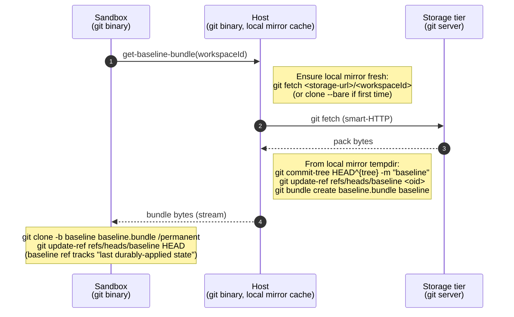
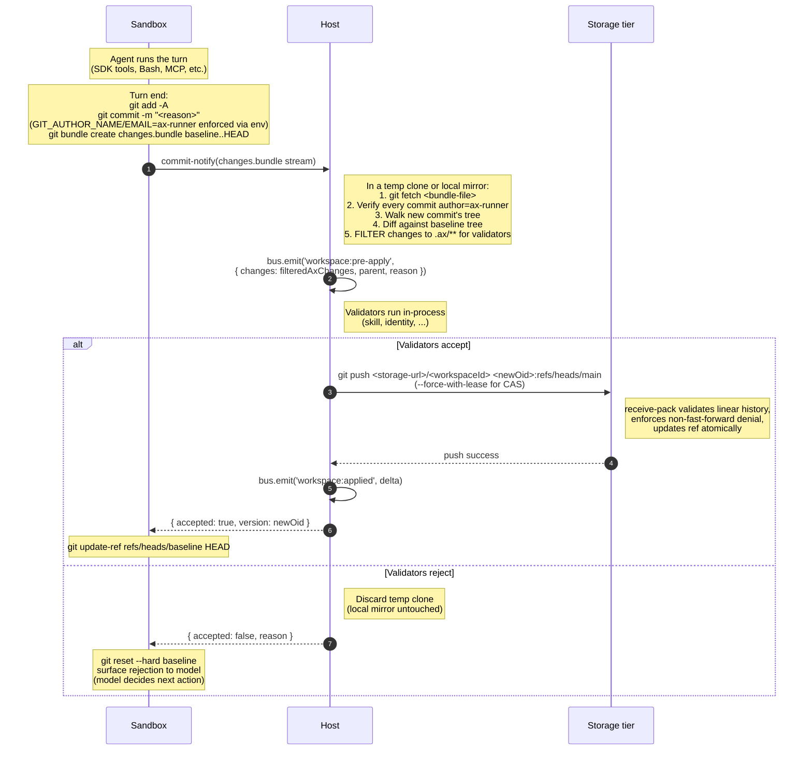

# Workspace redesign — design

**Status:** Proposed
**Date:** 2026-05-01
**Supersedes (in part):** `2026-04-25-workspace-git-http-handoff.md` (single-replica git-server pod), portions of `2026-04-22-plugin-architecture-design.md` Section 4.5 wire-protocol notes
**Brainstorm context:** `2026-04-30-workspace-redesign-brainstorming-context.md`
**Related:** `2026-04-29-runner-owned-sessions-design.md` (Phase B shipped, Phase C blocked on jsonl gap), `2026-04-29-phase-c-runner-jsonl-handling-impl.md` (this design subsumes Phase C's plan)

---

## Goal

A workspace plugin shape that:

1. Captures every byte the agent writes to disk — including `Bash` deletes/moves/writes, MCP-tool writes, and SDK-internal writes (the `.claude/projects/<sessionId>.jsonl` gap that surfaced this whole effort).
2. Exposes a hook surface (`workspace:pre-apply`) that lets validators veto changes to specific paths *before* durable apply. Day-1 validators: skill validator (YAML frontmatter on `.claude/skills/**/SKILL.md`) and identity validator (any change to `IDENTITY.md` / `SOUL.md`).
3. Keeps the storage tier swappable. The default ships with a git-binary-based git server; users can replace it with Gitea, GitHub Enterprise, GitLab, or any backend that speaks git smart-HTTP.
4. Scales to many concurrent agents in production via sharding by workspace.

Non-goals (deferred):

- GCS / S3 native backend. The architecture preserves the option but doesn't pay for it now.
- Multi-region replication. Single-region MVP.
- Active/standby HA per shard. Single-replica per shard with fast-restart for MVP.
- True per-file lazy fetch (ArtifactFS-grade). Eager materialize-on-session-start handles the workload.

---

## The five invariants — how this design lands them

Per `CLAUDE.md`:

- **I1 (no storage vocabulary in hook payloads).** Subscriber hooks (`workspace:pre-apply`, `workspace:applied`) carry canonical `WorkspaceChange[]` and `WorkspaceDelta`. Bundle bytes never reach subscribers; they're a transport detail on the sandbox-host axis. The four service hooks remain canonical.
- **I2 (no cross-plugin imports).** Sandbox-side and host-side plugins talk through the bus or over wire protocols (IPC, git smart-HTTP, REST). No shared modules.
- **I3 (no half-wired plugins).** First PR ships skill validator subscriber alongside the new wire surface. Second PR adds identity validator. Each PR is reachable from the canary acceptance test before merging.
- **I4 (one source of truth per concept).** ax git server owns *agent state*. External git servers (github, etc.) own *user code*. The two are explicitly separate; ax never mirrors external repos.
- **I5 (capabilities minimized).** Each tier's capability budget is explicit and walked in its own SECURITY.md. Git binary appears in two of three tiers, scoped to specific operations under paranoid env.

---

## Architecture overview

Three-tier topology:

```
┌──────────────────────────────────────┐
│   Sandbox pod (per session)          │
│   ├── claude-agent-sdk-runner        │
│   ├── git binary (paranoid env)      │
│   ├── /permanent  (ax-tracked)       │
│   │   ├── .ax/    (validated)        │
│   │   └── (project files if used)    │
│   └── /ephemeral  (emptyDir)         │
└──────────────────────────────────────┘
              ↕ IPC + bundle bytes
┌──────────────────────────────────────┐
│   Host pod (multi-replica, stateless)│
│   ├── orchestrator + IPC handlers    │
│   ├── validators (skill, identity)   │
│   ├── git binary (paranoid env)      │
│   ├── bundler logic (in-process)     │
│   └── workspace plugin (4 hooks      │
│       in-process; speaks git proto   │
│       outbound)                      │
└──────────────────────────────────────┘
              ↕ git smart-HTTP + REST CRUD
┌──────────────────────────────────────┐
│   Storage tier (sharded git servers) │
│                                      │
│   Default: @ax/workspace-git-server  │
│     ├── git binary                   │
│     ├── smart-HTTP endpoint          │
│     ├── REST CRUD for repo lifecycle │
│     └── bare repos on PVC            │
│                                      │
│   Alternative: any git server that   │
│   speaks smart-HTTP (Gitea, GitHub,  │
│   GitLab, ...) + small REST-CRUD     │
│   adapter                            │
└──────────────────────────────────────┘
```

Each tier owns a clear responsibility:

- **Sandbox:** runs the agent; mutates a local working tree under `/permanent`; produces change bundles at turn end. Per-session lifetime.
- **Host:** orchestrates; runs validators in-process; maintains local mirror caches of the workspaces it's currently serving (cache-shaped, regenerable). Stateless w.r.t. durable workspace state — any host replica can serve any workspace by fetching from storage.
- **Storage tier:** owns durable state. Sharded by `(userId, workspaceId)` for horizontal scale. Within a shard, single-writer; the in-process git lock files handle concurrency.

---

## Sandbox layout

Every sandbox has the same two top-level mounts. Different sandbox roles configure them differently, but the *shape* is constant.

```
/permanent/                      ← ax workspace, git-tracked, validated
├── .ax/                         ← agent state — validators watch these paths
│   ├── CLAUDE.md
│   ├── SOUL.md
│   ├── IDENTITY.md
│   ├── skills/
│   │   └── <skill>/SKILL.md
│   └── sessions/
│       └── <sessionId>.jsonl    ← Phase C reads from here
└── workspace/  (optional)       ← user's project, IFF this agent works on
                                   an ax-hosted project (Pattern A)

/ephemeral/                      ← emptyDir, gone when pod dies
├── .pnpm-store/                 ← package caches (PNPM_STORE_PATH=...)
├── .cargo/                      ← cargo registry/git caches
├── code/                        ← cloned external repos (Pattern B)
└── tmp/                         ← scratch beyond the project
```

CWD when the agent starts depends on the agent's role:

- **Pattern A** (project-on-ax): `cwd = /permanent/workspace/`
- **Pattern B** (external code work): `cwd = /ephemeral/` with task instructions to clone the relevant repo

The agent's `CLAUDE.md` describes the layout for the specific role. Agents don't need a universal convention; they read their own instructions.

### Why two mounts, not three

External code repos (the user's actual project on github / wherever) live in `/ephemeral/code/<repo-name>/`, *not* in a separate `/code/` mount. The agent clones them itself when the task requires. Reasons:

- No new mount type to provision per task. Sandbox provider handles network egress + credentials per task; agent handles the clone.
- Re-cloning is fast (typical task repo is seconds; large monorepos can use shallow clone or `--filter=blob:none`).
- Long-running tasks that benefit from cross-session repo persistence: configure `/ephemeral` itself with a Filestore-backed PVC instead of `emptyDir`. Same mount path, different backing volume — no architectural change.
- ax never tracks user code. The clean separation means ax's bundle/diff/validator pipeline stays small and fast regardless of repo size.

---

## Wire protocols

Two distinct wires, each with a clear purpose:

### Sandbox ↔ Host: bundle protocol (over IPC)

- **Materialize at session start:** Host streams a baseline bundle (orphan commit + tree + blobs reachable from the workspace's current HEAD). Sandbox does `git clone -b baseline baseline.bundle /permanent`.
- **Per-turn changes:** Sandbox produces `git bundle create changes.bundle baseline..HEAD` and streams it to host as a single HTTP-style upload over the IPC channel.

Bundle bytes never reach validators or any subscriber. The host unpacks them locally to canonical changes for `pre-apply`; on accept, the host does standard git operations against the storage tier.

### Host ↔ Storage tier: git protocol + REST CRUD

- **Repo lifecycle (REST):** `POST /repos`, `DELETE /repos/<id>`, `GET /repos/<id>`. Per-backend; small adapter for non-default backends.
- **Repo data plane (git smart-HTTP):** `git fetch`, `git push`, `git ls-tree`, `git cat-file`, `git diff-tree` — all standard git operations the host issues against its local mirror, with `git push` to the storage tier on apply.

The host maintains a local mirror clone per workspace it's actively serving (cache-shaped). Mirrors are refreshed via `git fetch` on access; pushes go to the storage tier with `--force-with-lease` (or equivalent) for CAS.

Because the wire is standard git protocol, **any git server is a valid storage backend.** Swap-ability is real — the only adapter work for a different backend is the REST CRUD shape, which is per-backend (~50–200 LOC).

---

## Plugin contract — the four canonical hooks (in-process API)

These are the **bus hooks** other plugins call. They are *implemented in-process by the host's workspace plugin* by issuing git operations against the host's local mirror and the storage tier.

```typescript
type WorkspaceVersion = string & { __brand: 'WorkspaceVersion' };  // opaque

type FileChange =
  | { path: string; kind: 'put'; content: Bytes }
  | { path: string; kind: 'delete' };

type WorkspaceDelta = {
  before: WorkspaceVersion | null;
  after: WorkspaceVersion;
  reason?: string;
  author?: { agentId: string; userId: string; sessionId: string };
  changes: Array<{
    path: string;
    kind: 'added' | 'modified' | 'deleted';
    contentBefore?: () => Promise<Bytes>;   // lazy
    contentAfter?:  () => Promise<Bytes>;   // lazy
  }>;
};

// Service hooks — the host workspace plugin registers exactly one impl
workspace:apply (ctx, { changes, parent, reason }) → { version, delta }
workspace:read  (ctx, { path, version? })          → Bytes
workspace:list  (ctx, { version?, pathGlob? })     → string[]
workspace:diff  (ctx, { from, to })                → WorkspaceDelta

// Subscriber hooks — bus owns dispatch; any plugin may subscribe
workspace:pre-apply (ctx, { changes, parent, reason }) → { decision: 'allow' | 'veto', reasons?: string[] }
workspace:applied   (ctx, delta)                       → void
```

The hooks remain backend-agnostic. A future Postgres-backed or GCS-backed workspace plugin would implement the same four hooks with a different in-process impl — the in-process API doesn't change, only the wire it speaks to its backing store.

---

## Storage tier specification

### Default container — `@ax/workspace-git-server`

- **Base image:** debian-slim or alpine + `git` package. Version-pinned in the container image.
- **HTTP server:** thin Node service (or Go — TBD; v1's implementation is a port candidate per the brainstorm context's "read for inspiration but don't blindly port") that:
  - Routes `/info/refs` and `/git-upload-pack` / `/git-receive-pack` to `git-http-backend` (CGI) or equivalent
  - Handles `/repos` REST CRUD
  - Authenticates every request with a bearer token + `crypto.timingSafeEqual` (mirroring `@ax/workspace-git-http` pattern)
- **Per-workspace bare repo:** `<repoRoot>/<workspaceId>.git/`. Created via `POST /repos`, deleted via `DELETE /repos/<id>`.
- **Git config (locked down):**
  - `core.hooksPath=/dev/null` (no server-side hooks)
  - `protocol.allow=never` (no remote helpers)
  - `receive.denyDeletes=true`, `receive.denyNonFastForwards=true` (linear history enforced server-side)
  - `gc.auto=...` (configurable, run `git gc` periodically)

### Capability budget (storage tier default)

- Process spawn: yes, scoped to `git`. Argv-injection prevented by validating workspace IDs against a strict regex before they reach any git command.
- Network: inbound HTTP on the configured port, no outbound. NetworkPolicy enforces.
- Filesystem: bound to `<repoRoot>/`.
- Env: locked down (`GIT_CONFIG_NOSYSTEM=1`, `GIT_CONFIG_GLOBAL=/dev/null`, `HOME=/nonexistent`, no `GIT_*` env vars beyond the locked-down ones the server sets).

### Sharding

Helm chart deploys the storage tier as a `StatefulSet` with `replicas: N`. Each replica owns a slice of workspaces by hash. Host's workspace plugin includes a routing layer:

```typescript
function shardForWorkspace(workspaceId: string, replicas: number): number {
  return crc32(workspaceId) % replicas;
}
const url = `http://workspace-git-server-${shardIndex}/`;
```

Re-sharding (when `N` changes) is a future operational concern — workspaces would need to be migrated between shards. Initial deployment picks an `N` and lives with it.

### Swap-ability

Alternative storage backends implement two surfaces:

1. **Standard git smart-HTTP / SSH** — already supported by Gitea, GitHub Enterprise, GitLab self-hosted, Bitbucket, anything serious. The host's workspace plugin uses `git fetch` / `git push` / `git ls-tree` against the configured URL. Zero adapter work for the data plane.
2. **REST CRUD for repo lifecycle** — the only backend-specific surface. Each non-default backend gets a small adapter (~50–200 LOC) translating "create repo for workspace X" / "delete repo" into the backend's specific API call.

This means **the workspace plugin's host-side code is mostly backend-agnostic.** Only the lifecycle adapter changes.

---

## Sequence diagrams

### Session start — materialize `/permanent`



### Turn cycle — agent edits, ships changes



Three round trips on the host-storage axis (`fetch` for materialize, `push` for apply on accept). Single round trip on the sandbox-host axis (one bundle stream up, one decision back).

---

## Validators — the half-wired window

Per I3, every PR that introduces a hook surface must also ship a real subscriber that exercises it. The validator hook (`workspace:pre-apply`) lands in the same PR as its first subscriber.

### Day-1 subscribers

- **Skill validator** — `@ax/validator-skill`. Subscribes to `workspace:pre-apply`, filters `changes` to paths matching `.claude/skills/**/SKILL.md`, parses YAML frontmatter, vetoes if frontmatter is malformed or missing required fields. Half-wired window pin for the first PR.
- **Identity validator** — `@ax/validator-identity`. Subscribes to `workspace:pre-apply`, vetoes any `put` or `delete` of `IDENTITY.md` or `SOUL.md` that isn't explicitly approved by some out-of-band mechanism (TBD — initial impl just flags, doesn't auto-veto, until the approval flow is designed). Lands in a follow-up PR.

### Filtering happens before `pre-apply` fires

The host's bundler logic walks the unpacked bundle's tree and produces canonical changes for ALL paths. It then filters to `.ax/**` before firing `workspace:pre-apply`. Validators see only paths they could possibly care about. The full unfiltered change set still gets pushed to the storage tier — validators veto only changes to validator-watched paths.

This means changes outside `.ax/` (e.g., to `/permanent/workspace/` if Pattern A is in use, or any other tracked path) flow through to durable apply without validator review. That's intentional — ax validates *agent state*, not *project content*.

### Validator hook contract

```typescript
workspace:pre-apply (ctx, {
  changes: WorkspaceChange[],   // filtered to .ax/** before this hook fires
  parent: WorkspaceVersion,
  reason: string,
}) → { decision: 'allow' | 'veto', reasons?: string[] };
```

Subscribers run in declaration order; first `veto` short-circuits the rest. `WorkspaceChange.contentAfter` is a lazy fetcher (returning `Promise<Bytes>`) so validators that only need path-level visibility don't pay the materialization cost.

---

## External code repos — agent-initiated

For coding agents (Pattern B), the agent clones external repos itself into `/ephemeral/code/`:

```
Task instructions in /permanent/.ax/CLAUDE.md or session prompt:
  "Fix bug X in github.com/foo/bar. Clone to /ephemeral/code/foo-bar."

Agent's first turn:
  cd /ephemeral
  git clone https://github.com/foo/bar code/foo-bar
  cd code/foo-bar
  git checkout -b fix-x
  (read code, edit, run tests)
  git add . && git commit -m "fix: X"
  git push origin fix-x
  (open PR via GitHub API or notify user)
```

What the sandbox provider configures per task:

- **Network egress policy** — permits the agent to reach the external git host. NetworkPolicy on the pod.
- **Credentials** — the credential-proxy plugin (Phase 1a, already shipped) injects a credential-helper socket. The agent never sees the raw token; `git push` Just Works against the configured remote.

External code work doesn't flow through ax's bundle/validator/apply pipeline. ax's bundle at turn end captures only `/permanent/.ax/` changes (session jsonl growth, occasional skill or identity edits). The code work is audited by the external git server's history.

If a single task needs the cloned repo to persist across sessions: configure `/ephemeral` to be backed by a Filestore PVC instead of `emptyDir`. Same mount path, different backing volume.

---

## Multi-host scaling — sharding by workspace

The host pod is multi-replica (stateless w.r.t. durable workspace state). Each host replica can serve any workspace by ensuring its local mirror is fresh.

The storage tier shards by `(userId, workspaceId)` — each shard pod owns a slice of workspaces. Within a shard, single-writer; the host's `git push` to a shard's URL serializes via standard git ref-update semantics on that shard's bare repo.

```
[host pod #1] ────┐
[host pod #2] ────┼─► (consistent-hash routing) ─► [storage shard #N]
[host pod #3] ────┘                                 owns workspace IDs in slice N
```

Cross-shard contention is impossible — each workspace lives on exactly one shard. Within a shard, in-process git lock files serialize concurrent pushes (rare in practice; per-user QPS is low for chat agents).

Re-sharding when `N` changes: deferred. Initial deployment picks `N` based on expected load and lives with it. If re-sharding is needed, that's a maintenance operation (drain, migrate workspaces, restore traffic) — not architectural change.

---

## `ax-runner` author enforcement

The architecture's `WorkspaceDelta.author` field carries `agentId` / `userId` / `sessionId` from the bus context — that's *provenance metadata*, separate from git commit author. The git commit author/committer is hard-coded to `ax-runner` per `workspace-git-core/SECURITY.md:75`.

Under bundle-direct-apply, the commit object lands in the production bare repo via `git push`, so its author field has to be `ax-runner` from the start (no host-side rewrite). Two layers of enforcement:

1. **Sandbox-side (cheap):** the sandbox provider sets:
   ```
   GIT_AUTHOR_NAME=ax-runner
   GIT_AUTHOR_EMAIL=ax-runner@example.com
   GIT_COMMITTER_NAME=ax-runner
   GIT_COMMITTER_EMAIL=ax-runner@example.com
   ```
   These env vars are inherited by every `git commit` the agent runs. The agent can't override them via `Bash` because the runner spawns the agent with these set explicitly.

2. **Host-side (defense in depth):** when the bundler unpacks an incoming bundle, it walks every commit in `baseline..HEAD` and verifies `author.name == 'ax-runner'` and `committer.name == 'ax-runner'`. Any deviation rejects the bundle outright before `pre-apply` runs. Catches sandbox config drift, sandbox compromise, or future bugs where env vars aren't set.

Net property: `git log` on the production bare repo always shows `ax-runner` as commit author. Agent identity flows through `WorkspaceDelta.author` for audit, not through git's author field.

---

## Boundary review (per CLAUDE.md)

For the new hooks and wire surfaces:

- **`workspace:pre-apply` payload (`changes: WorkspaceChange[]` filtered to `.ax/**`):**
  - Alternate impl this hook could have: yes — validators could be invoked over the wire (e.g., as separate validator pods), but for MVP they run in-process subscribed to the bus. The hook's payload is the same either way.
  - Payload field names that might leak: none. `path`, `kind ('added'|'modified'|'deleted')`, `contentAfter()` are all generic. No git-specific vocabulary.
  - Subscriber risk: validators must NOT key off `WorkspaceVersion` content (it happens to be a SHA today, won't be under future backends).
- **Sandbox-host bundle wire (`commit-notify(bundle bytes)`):**
  - Wire shape: opaque-bytes envelope. The host decodes to canonical `WorkspaceChange[]` before any subscriber-visible hook fires. This is the "Safe (a)" interpretation from the brainstorm context — bundle bytes are transport, never shape that reaches subscribers.
  - Payload field names: `parentVersion` (opaque token), `bundleBytes` (opaque bytes), `reason` (string, agent-supplied). No leak.
- **Host-storage git wire:**
  - Standard git smart-HTTP. No ax-specific fields. Storage backends are interchangeable as long as they speak this protocol.

---

## Security walk

Per `security-checklist`, the three threat models for each tier:

### Sandbox

- **Sandbox escape:** git binary in image is a new capability vs. the previous "no-git-in-sandbox" iteration. Scoped via paranoid env (`GIT_CONFIG_NOSYSTEM=1`, `core.hooksPath=/dev/null`, `protocol.allow=never` except `https` to the host's bundle endpoint) and locked-down git config. NetworkPolicy restricts egress to host IPC + bundle endpoint by default; Pattern B sandboxes get an additional egress permit for the relevant external git host.
- **Prompt injection:** the agent's commit message (`reason`) flows into the commit object byte-for-byte. The bundler does not interpolate it into shell commands. Any future subscriber that displays `reason` (e.g., audit notifications) must treat it as untrusted text.
- **Supply chain:** git binary is pinned to a specific version via the base image; CVE patches via base image rebase.

### Host

- **Sandbox escape:** git binary in image. Same paranoid env as sandbox. Spawn argv built only from validated paths and known constants (workspace IDs validated against strict regex; never interpolated unescaped into `git` argv). Bundle bytes from the sandbox are unpacked to a tempdir bare repo, never to the host's local mirror or production state — corrupt bundles can poison the tempdir but get discarded on session/turn end.
- **Prompt injection:** validators run in-process, see canonical changes only. They never `exec`, never shell-interpolate. Validator authors are first-party.
- **Supply chain:** git binary pinned via base image. Bundler logic is first-party.

### Storage tier (default)

- **Sandbox escape:** git binary, paranoid env, no outbound network, NetworkPolicy permits only inbound from host pods on the configured port. Bare repo storage is single-purpose; compromise risk = read-everyone's-workspace, mitigated by NetworkPolicy and bearer-auth.
- **Prompt injection:** schema-validates every REST request; rejects malformed workspace IDs at the HTTP layer.
- **Supply chain:** git binary pinned. Bare-repo HTTP server is small (~few hundred LOC) and first-party.

Per-tier SECURITY.md files document each in detail; this section is the architectural overview.

---

## Migration from current shipped state

What changes vs. today (`@ax/workspace-git-http` PR #11 + Phase B PR #29):

| Component | Today | New |
|--|--|--|
| Storage tier | Single-replica git-server pod, isomorphic-git, JSON-over-HTTP IPC for the four hooks | Sharded git-server pods, real `git` binary, smart-HTTP + REST CRUD |
| Host workspace plugin | `@ax/workspace-git-http` client speaking JSON-over-HTTP | New plugin speaking standard git protocol + small REST CRUD adapter |
| Sandbox-host wire | `workspace.commit-notify` carrying `FileChange[]` (eager, JSON) | `commit-notify` carrying bundle bytes (opaque, streamed) |
| Sandbox change detection | PostToolUse on Write/Edit/MultiEdit only (jsonl gap, Bash deletes invisible) | `git add -A && git status` against the sandbox's working tree (catches everything) |
| `.ax/` capture completeness | Incomplete (jsonl gap is the load-bearing failure) | Complete — git status sees every byte that hit `/permanent/` |
| Validators | None wired | `workspace:pre-apply` fires with `.ax/**`-filtered changes; skill validator subscribes |
| Capability story | iso-git in storage (no spawn); host has no git | Git binary in 2 of 3 tiers (sandbox + storage), scoped under paranoid env; host adds git binary for bundler logic |

### Phasing

1. **Phase 1 (this PR):** Replace storage tier (`@ax/workspace-git-server` container with git binary). Keep host's iso-git client for now; ship in parallel. Migrate one workspace as canary.
2. **Phase 2:** Replace host's workspace plugin (new git-protocol-based client). Sandbox-host wire still `FileChange[]`. Validate end-to-end.
3. **Phase 3:** Add bundle protocol to sandbox-host wire. Add `git status -based diff in sandbox runner. Skill validator subscriber lands in same PR.
4. **Phase 4:** Identity validator (follow-up PR).
5. **Phase 5:** Decommission `@ax/workspace-git-http` and `@ax/workspace-git` (legacy iso-git). Sharding-aware Helm chart.

Each phase ships with the half-wired-window discipline: the new wire is exercised by a real caller in the same PR.

---

## Open questions / known limits

1. **HA story per shard.** Single-replica per storage shard means a pod restart drops sessions on that shard's workspaces until the pod recovers. Acceptable for MVP; needs active/standby for production SLAs. *Not blocking MVP.*
2. **Re-sharding plan.** No automated rebalancing yet. Deferred until N actually needs to change. *Not blocking MVP.*
3. **Validator approval flow for `IDENTITY.md` / `SOUL.md`.** Identity validator currently flags but doesn't have an approval mechanism. TBD: out-of-band human approval? Multi-key signing? Specific allowlisted change patterns? *Lands with Phase 4.*
4. **Re-cloning cost for very large external repos** (Pattern B, multi-session). Pattern B currently re-clones every session in `/ephemeral`. For large monorepos this is expensive. Mitigation: configurable `/ephemeral` backing volume (Filestore PVC for persistence), shallow clone, repo cache service. *Operational, not architectural.*
5. **Cross-region.** Single-region MVP. Multi-region storage replication would require either active-active (consensus, complex) or active-passive (eventual consistency, simpler). *Out of scope.*
6. **GC of dangling objects from rejected pushes.** Storage tier runs `git gc --auto` periodically. Rejected pushes leave dangling commits (the `--force-with-lease` failed). Same as today's iso-git "no GC" known limit but now with native gc available. *Operational.*
7. **First-time materialize when storage has zero state.** A brand-new workspace has no `refs/heads/main`; the host's local mirror clone fails. Handle by treating empty-repo case as "skip clone, sandbox starts with empty `/permanent/`, first commit creates main." Implementation detail, not architectural blocker.

---

## Summary of decisions (for future reference)

- Three-tier topology (sandbox / multi-replica host / sharded storage) — keep storage as a separate tier, swappable
- Git binary, not iso-git, in the default storage tier — performance for high-concurrency
- Git protocol on the wire between host and storage — natural, swappable, mature
- Bundle protocol on the sandbox-host axis — bandwidth-efficient, reuses git binary in sandbox + host
- `/permanent` + `/ephemeral` sandbox layout — semantics in the names
- External code repos: agent-initiated in `/ephemeral/code/`, NOT a separate mount type
- Validators see filtered `.ax/**` canonical changes — sharper hook surface
- `ax-runner` author enforced sandbox-side via env + verified host-side in bundle unpack
- Storage tier's hook contract (the four canonical hooks) is in-process; the wire is git protocol — separates contract from transport
