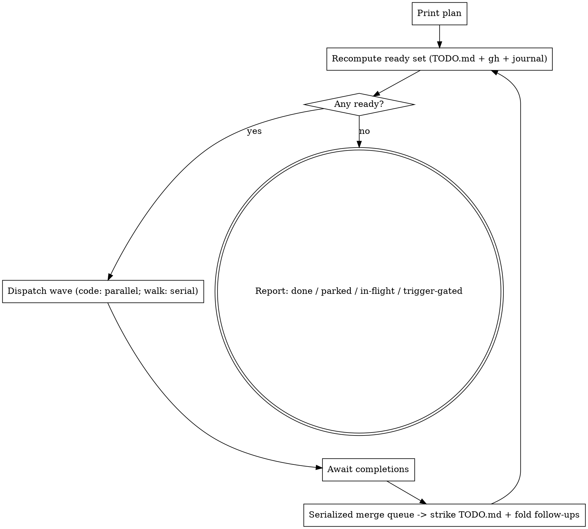
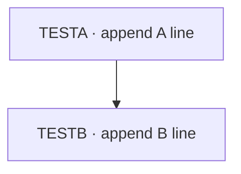
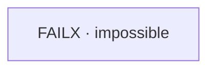

# dag-ship Implementation Plan

> **For agentic workers:** REQUIRED SUB-SKILL: Use superpowers:subagent-driven-development (recommended) or superpowers:executing-plans to implement this plan task-by-task. Steps use checkbox (`- [ ]`) syntax for tracking. Authoring tasks also use superpowers:writing-skills.

**Goal:** Build a `dag-ship` orchestrator skill that drains the `TODO.md` DAG in parallel waves, and modify `yolo-ship` to auto-merge green PRs (suppressed under dag-ship's serialized queue).

**Architecture:** `dag-ship` is a user-invocable skill the main session follows as orchestrator. It computes the ready set from the `TODO.md` mermaid edge-map + strike-throughs + `gh pr list`, dispatches one background `yolo-ship` agent per ready code task (serialized walk agents for cluster lane), serially merges the green PRs, folds strike-throughs/follow-ups back into `TODO.md`, and loops. All state is on disk so the run is resumable. Failure loops are prevented by a failure-signature breaker + attempt/depth/global caps.

**Tech Stack:** Claude Code skills (markdown + frontmatter), `references/` sub-files (existing pattern: chat-qa-sweep, k8s-acceptance-loop), the `Agent` tool (background + parallel), `gh` CLI, `git`. No compiled code — the skill is followed by Claude; verification is a safe dry-run reasoning check plus two guided side-effecting live runs.

**Spec:** `docs/plans/2026-05-24-dag-ship-design.md` (§1–§13).

---

## File Structure

| File | Responsibility | Action |
|---|---|---|
| `.claude/skills/dag-ship/SKILL.md` | Lean orchestration logic: prime directive, state/readiness, control loop, wave dispatch, merge queue, walk lane, failure guards, progress files, termination, safety. | Create |
| `.claude/skills/dag-ship/references/templates.md` | Verbatim copy-don't-paraphrase artifacts: the two dispatch prompts, failure-signature normalization rules, status-dashboard format, journal line formats. | Create |
| `.claude/skills/yolo-ship/SKILL.md` | Add Phase 7 (auto-merge standalone / hand-off orchestrated); update autonomy-contract items 3 & 5; update ship DOT graph + exit line. | Modify |
| `.gitignore` | Ignore the two operational tracking files. | Modify |
| `docs/plans/2026-05-24-dag-ship-design.md` | The approved spec (already committed). | Reference only |

`SKILL.md` keeps process/decision logic; `references/templates.md` holds the literal text the orchestrator copies. Split by responsibility, mirroring the repo's existing multi-file skills.

---

## Task 1: Create dag-ship skill directory + SKILL.md

**Files:**
- Create: `.claude/skills/dag-ship/SKILL.md`

- [ ] **Step 1: Announce sub-skill** — Use `superpowers:writing-skills` for this and Task 2 (frontmatter rules, description-triggering, structure).

- [ ] **Step 2: Create the directory**

```bash
mkdir -p .claude/skills/dag-ship/references
```

- [ ] **Step 3: Write `SKILL.md` verbatim**

````markdown
---
name: dag-ship
description: Use when asked to autonomously drain the TODO.md task DAG in parallel — read the dependency graph, ship every task that has no unmet dependency via yolo-ship in parallel waves, auto-merge the green PRs through a serialized queue, recompute the newly-unblocked tasks, and loop until the DAG is empty. Triggers on "drain the TODO DAG", "ship all the ready TODO tasks in parallel", "run dag-ship", "work the TODO.md graph autonomously", "fan out the backlog and ship it". For a SINGLE task, use yolo-ship instead.
user-invocable: true
---

# dag-ship — drain the TODO.md DAG in parallel waves

## Overview

`TODO.md` carries a parallelization DAG: a fenced ```mermaid edge-map, inline
`[TASK-ID]` checkbox lines, a ⚠ cluster-walk lane, and a 🚫 trigger-gated set.
This skill drains it — find every **ready** task (no unmet dependency), ship each
via `yolo-ship` in parallel, merge the green PRs through a **serialized** queue,
recompute what's now unblocked, and loop until nothing remains but trigger-gated
or quarantined work.

You are the **orchestrator**. You dispatch agents; you do not implement. Heavy
work lives in subagents so your context stays lean. All durable state lives **on
disk** (TODO.md + open PRs + two tracking files), so a run is fully **resumable**:
if your context grows, end the session and re-invoke `/dag-ship` — it rebuilds
and continues.

Design: `docs/plans/2026-05-24-dag-ship-design.md`. Verbatim templates:
`references/templates.md`.

## Prime directive — context discipline

Hold **only** the DAG edge-map and **≤1 line of status per in-flight task**.
Never read task source, diffs, or agent transcripts into your context. Enforce a
**≤150-word structured handoff** from every dispatched agent. After every merge,
**re-derive** state from disk — do not accumulate across waves.

| Thought | Reality |
|---|---|
| "Let me peek at the diff to check it" | The agent + CI + Codex already did. You hold a one-line status. |
| "I'll remember what wave 1 did" | Re-read TODO.md. Cross-wave memory is the trap; disk is truth. |
| "I'll merge these two at once to be fast" | The merge queue is serialized. One PR at a time, always. |
| "Context is getting big, push through" | End + re-invoke `/dag-ship`. State is on disk; resume is free. |

## State model & readiness

Source of truth = the ```mermaid block in TODO.md + the inline `[TASK-ID]` lines.

- **Done** — the task's checkbox line is struck through (`~~…~~`).
- **In-flight** — an open PR whose title starts `[TASK-ID]` (`gh pr list`).
- **Parked** — a `🛑 [TASK-ID]` line in TODO.md (see Failure handling).
- **Trigger-gated** — in the 🚫 subgraph; never dispatched.

Read the mermaid edges. `A --> B` and `A -.-> B` both mean **B depends on A**
(dashed = "coordinate / don't run concurrently" — it gates dispatch identically).

A task is **ready** iff ALL hold: not done, not in-flight, not parked, not
trigger-gated, and **every** node on the left of an edge into it is **done**.

Two lanes:
- **Code lane** — produces a mergeable PR → parallel `yolo-ship` agents.
- **Cluster-walk lane** — the ⚠ manual-acceptance walks → **serialized** (they
  share one cluster), one `k8s-acceptance-loop` agent at a time.

## Control loop



**Print the plan before wave 1** (and refresh the dashboard on every recompute)
so a watching human can interrupt. `--dry-run` stops after the first plan print —
no dispatch.

## Dispatching a wave

1. Refresh `.claude/dag-ship-status.md`; append `wave N dispatch …` to
   `.claude/dag-ship-log.md`.
2. **Code lane:** in a SINGLE message, launch one **background** agent per ready
   code task (`Agent`, `run_in_background: true`, `subagent_type: general-purpose`)
   using the **code-lane dispatch prompt** in `references/templates.md`.
   Background + one message ⇒ concurrent + you're notified on completion.
3. **Walk lane:** launch **one** walk agent (serialized) using the **walk-lane
   dispatch prompt**; do not start the next walk until the current finishes.
4. Record each dispatch (task ID) in the journal.

Each agent runs `yolo-ship` (code) or `k8s-acceptance-loop` (walk) on exactly one
task in **orchestrated mode** — green+mergeable PR, no self-merge, no TODO.md
edit — and returns the ≤150-word handoff.

## Merge queue (serialized — you own it)

Process completed code PRs **one at a time**:

```bash
git fetch origin
gh pr view <n> --json mergeable,statusCheckRollup     # confirm green + mergeable
# if NOT mergeable (main moved): check out the branch, rebase onto main,
#   resolve conflicts, push, wait for CI to re-green, then continue.
gh pr merge <n> --squash --delete-branch
git checkout main && git pull --ff-only
```

Then: strike the task line in TODO.md, append `— shipped: #<n>`, fold the agent's
reported follow-ups into TODO.md (you are the **sole writer**), append
`merged #<n>` to the journal. **Never** merge two PRs concurrently.

## Cluster-walk lane

Pre-flight: `kubectl --context kind-ax-next-dev get nodes`. If the cluster is
down, park the whole walk lane with a note and keep draining the code lane. Run
walks **one at a time**; rebuild the agent image first for image-baked walks
(CLI-2, SYNC-1, FAULTA-1 — see the `docker-build-cache-runner-fixes` memory).
**Pass** → strike through. **Fail** → file a follow-up code task in TODO.md
carrying `parent` + the failure signature; the normal loop picks it up, governed
by Failure handling.

## Failure handling & loop prevention

Every failing agent/walk returns a **normalized failure signature** (rules in
`references/templates.md`). Guards (all read from the journal, so they survive a
resume):

1. **Same-signature breaker (core).** A follow-up records `parent` + the parent's
   signature `S`. When the parent re-runs after its fix merges and fails with the
   **same `S`** → **quarantine the parent** (`🛑`) and spawn **no** new follow-up.
   The loop dies on the first repeat. A **different** signature = real progress →
   a follow-up may spawn (bounded below).
2. **Attempt cap = 2** per task. Two failures (or two identical signatures) →
   quarantine.
3. **Follow-up chain depth cap = 2.** Each spawned task carries `depth`; at the
   cap, park for a human instead of spawning further.
4. **Global breaker:** halt + report if a run exceeds **10** auto-spawned tasks
   OR **3×** the initial actionable-task count in total dispatches.
5. **Stall detector:** a completed wave that leaves the done-count unchanged AND
   the ready-set identical → halt + report.

Quarantine is visible: `🛑 [TASK-ID] (parked after N attempts — <signature>)` in
TODO.md + a journal row, excluded from the ready set.

## Progress files (both gitignored)

- `.claude/dag-ship-status.md` — the **dashboard**, overwritten on every state
  change (format in `references/templates.md`). Watch: `watch -n5 cat
  .claude/dag-ship-status.md`.
- `.claude/dag-ship-log.md` — the **journal**, append-only timeline + failure
  ledger. Watch: `tail -f .claude/dag-ship-log.md`.

On resume, rebuild both from TODO.md + `gh pr list` + the journal.

## Termination & reporting

Stop when **no ready tasks AND no in-flight tasks**. Emit a final report:
shipped (PR#s), parked (reasons/signatures), still-trigger-gated, and any
walk-filed follow-ups. TODO.md remains the durable record.

## Safety

- `--dry-run` prints the wave/lane plan + skip-list and stops — no dispatch.
- The plan is printed before wave 1 regardless; a watching human can interrupt.
- First-ever validation: point dag-ship at a throwaway 2-node DAG before the real
  TODO.md (design §9), and at a deliberately-failing node to confirm the breaker
  parks it.

## Red flags — you are rationalizing

| Thought | Reality |
|---|---|
| "I'll just implement this small task inline" | You're the orchestrator. Dispatch it. Inline work blows the budget. |
| "The walk failed; I'll re-file the fix again" | Same signature ⇒ quarantine. Re-filing the same failure is the loop you must not create. |
| "Two PRs are green, merge both now" | Serialized queue. One at a time, rebase-on-conflict. |
| "I'll skip the dry-run, the DAG looks obvious" | Print the plan first. Auto-merging to main is high blast-radius. |
| "I'll edit TODO.md from the agent to save a step" | Agents never write TODO.md. You are the sole writer (avoids conflicts). |
````

- [ ] **Step 4: Verify the skill is well-formed and discoverable**

Run: `head -5 .claude/skills/dag-ship/SKILL.md`
Expected: valid YAML frontmatter with `name: dag-ship`, a `description:` starting with "Use when", and `user-invocable: true`.

- [ ] **Step 5: Commit**

```bash
git add .claude/skills/dag-ship/SKILL.md
git commit -m "feat(dag-ship): add DAG-draining orchestrator skill (SKILL.md)"
```

---

## Task 2: Create references/templates.md

**Files:**
- Create: `.claude/skills/dag-ship/references/templates.md`

- [ ] **Step 1: Write `references/templates.md` verbatim**

````markdown
# dag-ship templates — copy these literally, do not paraphrase

## Code-lane dispatch prompt

Dispatch via `Agent` with `run_in_background: true`,
`subagent_type: "general-purpose"`. Substitute `<TASK-ID>`, `<TASK-TITLE>`,
`<TASK-BODY>` (copy the task's line from TODO.md), `<short-slug>`:

> You are shipping ONE task from this repo's `TODO.md`, end to end, under
> orchestration by dag-ship.
>
> **Task <TASK-ID>:** <TASK-TITLE>
> <TASK-BODY>
>
> Run the `yolo-ship` skill on this task with these ORCHESTRATED-MODE overrides:
> - Branch: `dag-ship/<TASK-ID>-<short-slug>`. PR title MUST start with
>   `[<TASK-ID>] `. Base `main`.
> - **Do NOT merge.** Stop at a green, verified-mergeable PR (yolo-ship ends at
>   Phase 6 for you). dag-ship merges it through a serialized queue.
> - **Do NOT edit `TODO.md`.** Return deferred follow-ups in your handoff instead.
> - Otherwise follow yolo-ship exactly: worktree, self-answering brainstorm,
>   written plan, subagent-driven TDD, build+test+lint gate, local Codex review,
>   open PR, drive CI green.
>
> Return ONLY this handoff, ≤150 words:
> ```
> task: <TASK-ID>
> outcome: pr-green | failed
> pr: <#> | -
> headSha: <sha> | -
> mergeable: y | n | -
> ci: green | red | pending
> signature: <normalized failure signature> | -    # required iff outcome=failed
> followups:
>   - <one line each, or "none">
> ```

## Walk-lane dispatch prompt

Dispatch ONE at a time (serialized). Substitute as above:

> You are running ONE manual-acceptance walk from `TODO.md` under dag-ship,
> against the kind cluster.
>
> **Task <TASK-ID>:** <TASK-TITLE>
> <TASK-BODY>
>
> Run the `k8s-acceptance-loop` skill to perform this walk against
> `kind-ax-next-dev`. If the task involves the runner image (image-baked),
> rebuild it first (see the `docker-build-cache-runner-fixes` memory). Drive the
> UI via Playwright MCP; capture evidence.
>
> Return ONLY this handoff, ≤150 words:
> ```
> task: <TASK-ID>
> outcome: walk-pass | walk-fail
> evidence: <one line: what you observed>
> signature: <normalized failure signature> | -    # required iff walk-fail
> followups:
>   - <one line each, or "none">    # for walk-fail: the bug to fix
> ```

## Failure-signature normalization

Build a stable, low-cardinality string so the same root cause hashes identically
across attempts. Strip line numbers, timestamps, SHAs, PIDs, ports, tmp paths.
Shape: `<lane>:<TASK-ID>:<where>:<symptom>`.

- CI test fail: `ci:<TASK-ID>:<test-file-or-suite>:<error-class>`
  — e.g. `ci:ARCH-2:ipc-dispatcher.test:assertion`
- Build/lint:   `build:<TASK-ID>:<tool>:<first-error-code>`
  — e.g. `build:ARCH-6:tsc:TS2345`
- Walk:         `walk:<TASK-ID>:<step>:<symptom>`
  — e.g. `walk:CLI-1:git-clone:auth-403`
- Agent gave up: `agent:<TASK-ID>:<phase>:gave-up`

## Status dashboard format — `.claude/dag-ship-status.md` (overwrite each change)

```
# dag-ship — live status
_updated <YYYY-MM-DD HH:MM:SS> · wave <N> · started <HH:MM:SS>_

<done>/<total> done · <k> in-flight · <k> ready · <k> blocked · <k> parked  (+<k> trigger-gated, skipped)
<progress-bar>   budget: <d>/<dmax> dispatches · <s>/<smax> spawns

## in-flight
<TASK-ID>  <state: ci|merging|walk-running>  <#PR|->  <ci: green|red|pending|->

## ready (next)
<TASK-ID>   (deps clear)

## blocked
<TASK-ID> <- <blocking TASK-ID(s)>

## parked 🛑
<TASK-ID>  (<N> attempts — <signature>)

## done ✅
<TASK-ID> #<PR> · <TASK-ID> #<PR> · …
```

## Journal line formats — `.claude/dag-ship-log.md` (append-only)

```
<HH:MM:SS>  run start · actionable=<k> · budget <dmax> dispatches / <smax> spawns
<HH:MM:SS>  wave <N> dispatch · <TASK-ID> <TASK-ID> …
<HH:MM:SS>  <TASK-ID>  pr-green #<n> mergeable=<y|n>
<HH:MM:SS>  <TASK-ID>  merged #<n> -> main (ff)
<HH:MM:SS>  <TASK-ID>  walk-pass | walk-fail
<HH:MM:SS>  <TASK-ID>  failed attempt=<N> sig=<signature> parent=<id|-> depth=<d> [-> PARKED]
<HH:MM:SS>  HALT · <reason: global-breaker|stall|cluster-down>
```
````

- [ ] **Step 2: Verify both dispatch prompts and all format blocks are present** (targeted anchors — avoid header counts, since the dashboard sample itself contains `##` lines)

Run: `grep -n 'Code-lane dispatch prompt\|Walk-lane dispatch prompt\|Failure-signature normalization\|Status dashboard format\|Journal line formats' .claude/skills/dag-ship/references/templates.md`
Expected: one match for each of the five section headers.

Run: `grep -n 'ORCHESTRATED-MODE\|walk-pass\|sig=<signature>\|budget:' .claude/skills/dag-ship/references/templates.md`
Expected: matches in the code prompt, walk prompt, journal, and dashboard respectively.

- [ ] **Step 3: Commit**

```bash
git add .claude/skills/dag-ship/references/templates.md
git commit -m "feat(dag-ship): add verbatim dispatch/format templates"
```

---

## Task 3: Gitignore the operational tracking files

**Files:**
- Modify: `.gitignore`

- [ ] **Step 1: Confirm they're not already ignored**

Run: `git check-ignore .claude/dag-ship-status.md .claude/dag-ship-log.md; echo "exit $?"`
Expected: `exit 1` (not yet ignored).

- [ ] **Step 2: Append ignore rules**

Add these lines to `.gitignore`:

```
# dag-ship operational run state (regenerated from TODO.md + gh on resume)
.claude/dag-ship-status.md
.claude/dag-ship-log.md
```

- [ ] **Step 3: Verify**

Run: `git check-ignore .claude/dag-ship-status.md .claude/dag-ship-log.md; echo "exit $?"`
Expected: both paths printed, `exit 0`.

- [ ] **Step 4: Commit**

```bash
git add .gitignore
git commit -m "chore(dag-ship): gitignore operational run-state files"
```

---

## Task 4: yolo-ship — autonomy contract items 3 & 5

**Files:**
- Modify: `.claude/skills/yolo-ship/SKILL.md` (item 5 at line ~21, item 3 at line ~19)

- [ ] **Step 1: Replace autonomy-contract item 5**

Find (exact):

```
5. **Done = branch codex-reviewed clean *before* the PR + CI green.** The review runs locally with Codex (`gpt-5.5` / `xhigh` effort, read-only) before the PR exists — there is **no hosted-reviewer wait**. You do **NOT** merge. Stop at a green PR and report the link.
```

Replace with:

```
5. **Done = branch codex-reviewed clean *before* the PR + CI green, then merged.** The review runs locally with Codex (`gpt-5.5` / `xhigh` effort, read-only) before the PR exists — there is **no hosted-reviewer wait**. When CI is green you **auto-merge** (Phase 7) and fast-forward local `main`. **Exception — orchestrated mode:** if dag-ship dispatched you, do **NOT** merge and do **NOT** edit `TODO.md` — stop at a green, verified-mergeable PR and return the handoff; dag-ship owns the serialized merge queue.
```

- [ ] **Step 2: Extend autonomy-contract item 3 with the orchestrated-mode carve-out**

Find (exact):

```
3. **Follow-up work goes in `TODO.md`** — never silently dropped. Anything you deliberately defer is a TODO line, not a memory.
```

Replace with:

```
3. **Follow-up work goes in `TODO.md`** — never silently dropped. Anything you deliberately defer is a TODO line, not a memory. **Orchestrated mode:** don't edit `TODO.md` — return follow-ups in your handoff so dag-ship (the sole writer) folds them in.
```

- [ ] **Step 3: Verify**

Run: `grep -n 'auto-merge\|Orchestrated mode\|serialized merge queue' .claude/skills/yolo-ship/SKILL.md`
Expected: matches in items 3 and 5.

- [ ] **Step 4: Commit**

```bash
git add .claude/skills/yolo-ship/SKILL.md
git commit -m "feat(yolo-ship): auto-merge default + orchestrated-mode carve-out (contract)"
```

---

## Task 5: yolo-ship — Phase 7 (auto-merge), DOT graph, exit line

**Files:**
- Modify: `.claude/skills/yolo-ship/SKILL.md` (ship DOT graph ~97-109, exit line ~114, add Phase 7 after Phase 6)

- [ ] **Step 1: Update the Phase 6 ship DOT graph terminal node**

Find (exact, both occurrences):

```
    "Done: report PR link (do NOT merge)" [shape=doublecircle];
```
```
    "CI green?" -> "Done: report PR link (do NOT merge)" [label="yes"];
```

Replace respectively with:

```
    "CI green -> Phase 7 (merge)" [shape=doublecircle];
```
```
    "CI green?" -> "CI green -> Phase 7 (merge)" [label="yes"];
```

- [ ] **Step 2: Replace the Phase 6 exit line**

Find (exact):

```
- **Exit only when CI is green.** Then report the PR link and stop. You do **NOT** merge.
```

Replace with:

```
- **When CI is green, proceed to Phase 7** (auto-merge standalone, or hand off under orchestration). Do not declare done at a green PR — merging (or handing off) is the terminal step now.
```

- [ ] **Step 3: Append Phase 7 immediately after the Phase 6 section** (before `## Red flags`)

Insert:

````markdown
### Phase 7 — Merge: auto-merge (standalone) or hand off (orchestrated)

How this phase behaves depends on **mode**:

- **Standalone** (a human ran `/yolo-ship` directly) — **default: auto-merge.**
- **Orchestrated** (dag-ship dispatched you — the dispatch prompt says so) — **do
  NOT merge, do NOT touch `TODO.md`.** Stop at the green, verified-mergeable PR
  and return your handoff. dag-ship's serialized merge queue does the merge +
  local-main update + `TODO.md` strike. This is how dag-ship safely serializes
  many parallel agents.

**Standalone auto-merge:**

```bash
gh pr view <n> --json mergeable,statusCheckRollup    # must be green + mergeable
gh pr merge <n> --squash --delete-branch
git checkout main && git pull --ff-only
```

If the PR is **not mergeable** because `main` moved while you worked: check out
the branch, `git rebase origin/main`, resolve conflicts, push, wait for CI to
re-green (`gh pr checks <n>`), then merge. A non-trivial rebase changes the diff —
re-run the Phase 5 Codex review on the new diff before merging.

After merging: strike the task in `TODO.md`, append `— shipped: #<n>`, and report
the merge. Then you are done.
````

- [ ] **Step 4: Update the Quick-reference table Ship row**

Find (exact):

```
| Ship | commit-commands:commit-push-pr, superpowers:systematic-debugging, `gh`, `ScheduleWakeup` |
```

Replace with:

```
| Ship | commit-commands:commit-push-pr, superpowers:systematic-debugging, `gh`, `ScheduleWakeup` |
| Merge (Phase 7) | `gh pr merge --squash`, `git pull --ff-only` (standalone); hand off to dag-ship (orchestrated) |
```

- [ ] **Step 5: Add a red-flags row for the new merge behavior**

Find (exact):

```
| "I'll review locally after I open the PR" | The review is the gate *before* the PR. Open it only once Codex is clean. |
```

Replace with:

```
| "I'll review locally after I open the PR" | The review is the gate *before* the PR. Open it only once Codex is clean. |
| "dag-ship dispatched me but I'll merge anyway" | Orchestrated mode = stop at a green PR + hand off. Self-merging races the other agents and corrupts the serialized queue. |
```

- [ ] **Step 6: Verify the edits are coherent**

Run: `grep -n 'Phase 7\|auto-merge\|--ff-only\|hand off' .claude/skills/yolo-ship/SKILL.md`
Expected: Phase 7 header, the merge commands, and the orchestrated hand-off note all present.

Run: `grep -n 'do NOT merge\|do \*\*NOT\*\* merge' .claude/skills/yolo-ship/SKILL.md`
Expected: read each match and confirm **every** remaining occurrence is in an **orchestrated-mode** context (item 5 carve-out, Phase 7 orchestrated branch, the new red-flag row). There must be **no** "do NOT merge" left on the **standalone** path — the standalone path now says auto-merge. The ship DOT graph must no longer contain "(do NOT merge)" (replaced in Step 1).

- [ ] **Step 7: Commit**

```bash
git add .claude/skills/yolo-ship/SKILL.md
git commit -m "feat(yolo-ship): add Phase 7 auto-merge (standalone) / hand-off (orchestrated)"
```

---

## Task 6: Safe validation — dry-run readiness against the real TODO.md

No side effects (no agents dispatched, no PRs). This proves the readiness
algorithm in SKILL.md against the actual DAG.

**Files:** none modified.

- [ ] **Step 1: Invoke the skill in dry-run mode**

Invoke `/dag-ship --dry-run` (or, following the skill, compute and print the plan
from `TODO.md` without dispatching).

- [ ] **Step 2: Assert the printed plan**

Expected first wave (ready, code lane): exactly **ARCH-1, ARCH-4, ARCH-5,
ARCH-8, CLI-3**.

Expected blocked, with the blocking edge shown:
- ARCH-2 ← ARCH-4
- ARCH-3 ← ARCH-5
- ARCH-6 ← ARCH-1, ARCH-3, ARCH-5
- ARCH-7 ← ARCH-6
- CLI-2 ← CLI-3

Expected cluster-walk lane (serialized): CLI-1, SYNC-1, SYNC-2, FAULTA-1,
FAULTA-4 ready-but-serialized; CLI-2 blocked (above); FAULTA-4 notes the dashed
`FAULTA-1 -.-> FAULTA-4` ordering.

Expected skipped (🚫 trigger-gated, never dispatched): CLI-4, CLI-5, CLI-6,
CLI-7, FAULTA-2, FAULTA-3, FAULTA-5.

Expected: **no agents dispatched**; no `dag-ship-status.md`/`-log.md` writes
beyond the dry-run plan print (dry-run may print but must not start a wave).

- [ ] **Step 3: If the computed sets differ from the above, fix SKILL.md's readiness rules** (re-read the §2 "ready iff" definition and the mermaid edge interpretation) and re-run Step 1. Commit any fix:

```bash
git add .claude/skills/dag-ship/SKILL.md
git commit -m "fix(dag-ship): correct readiness computation per dry-run"
```

---

## Task 7: Guided live validation — throwaway 2-node DAG (SIDE EFFECTS)

⚠ **Side effects:** creates a throwaway branch + 2 real PRs + 2 merges to `main`.
Run only when ready; it also proves the 3-deep agent nesting (dag-ship →
yolo-ship → its subagents) and the serialized merge queue.

**Files:** Create (throwaway): `docs/plans/_dagship-selftest-TODO.md`

- [ ] **Step 1: Write a 2-node throwaway DAG** with trivial, real-but-harmless tasks (each appends a line to a scratch file), one depending on the other:

````markdown
# selftest DAG

- [ ] **[TESTA] Append the line `selftest-A` to `docs/plans/_dagship-scratch.txt`** (create the file if absent).
- [ ] **[TESTB] Append the line `selftest-B` to `docs/plans/_dagship-scratch.txt`.**
````

- [ ] **Step 2: Run dag-ship against the throwaway file** (point the skill at `docs/plans/_dagship-selftest-TODO.md` instead of `TODO.md` for this run).

- [ ] **Step 3: Assert behavior**
  - Wave 1 dispatches **only** TESTA (TESTB blocked by the edge).
  - TESTA's PR title starts `[TESTA] `, branch `dag-ship/TESTA-…`, merges via the serialized queue, `main` fast-forwarded, TESTA struck through.
  - Wave 2 then dispatches TESTB; it merges; TESTB struck through.
  - `dag-ship-status.md` showed the transition; `dag-ship-log.md` has `merged #` lines for both.
  - Terminates cleanly (no ready, no in-flight).

- [ ] **Step 4: Clean up the throwaway artifacts**

```bash
git rm -f docs/plans/_dagship-selftest-TODO.md docs/plans/_dagship-scratch.txt 2>/dev/null
git commit -m "chore(dag-ship): remove 2-node self-test fixtures" || true
```

(If the self-test merged the scratch edits to `main`, revert those trivial commits or leave the scratch file deleted — note it in the run report.)

---

## Task 8: Guided live validation — failure-breaker (SIDE EFFECTS)

⚠ **Side effects:** dispatches an agent on a task engineered to fail twice.
Proves the attempt cap + same-signature breaker park the task instead of looping.

**Files:** Create (throwaway): `docs/plans/_dagship-failtest-TODO.md`

- [ ] **Step 1: Write a 1-node DAG with an impossible task**

````markdown
# failtest DAG

- [ ] **[FAILX] Make `pnpm test` pass while ALSO adding a test that asserts `expect(1).toBe(2)`** (intentionally unsatisfiable — the agent cannot produce a green PR).
````

- [ ] **Step 2: Run dag-ship against the failtest file.**

- [ ] **Step 3: Assert behavior**
  - FAILX is dispatched, the agent returns `outcome: failed` with a `signature`.
  - dag-ship records attempt=1, re-dispatches (attempt 2), gets the **same**
    signature → **quarantines** FAILX: `🛑 [FAILX] (parked after 2 attempts — <signature>)` written to the failtest file + a `-> PARKED` journal line.
  - The loop **terminates** (no infinite re-dispatch); final report lists FAILX as parked.

- [ ] **Step 4: Clean up**

```bash
git rm -f docs/plans/_dagship-failtest-TODO.md 2>/dev/null
git commit -m "chore(dag-ship): remove failure-breaker self-test fixture" || true
```

---

## Self-Review

**Spec coverage** (design §1–§13 → task):
- §1 topology (main-session orchestrator, disk state, resumable) → Task 1 (Overview + Prime directive).
- §2 state model & readiness (mermaid edges, lanes) → Task 1 + verified in Task 6.
- §3 control loop → Task 1 (DOT).
- §4 dispatch contract (≤150-word handoff, branch/PR naming) → Task 2 (both prompts).
- §5 merge queue (serialized git/gh) → Task 1 (Merge queue section).
- §6 cluster-walk lane → Task 1 + Task 2 (walk prompt).
- §7 context discipline → Task 1 (Prime directive + red flags).
- §8 yolo-ship mods (Phase 7, orchestrated flag, contract item 3) → Tasks 4 & 5.
- §11 failure handling (5 guards, signature rules) → Task 1 (Failure handling) + Task 2 (signature normalization) + verified in Task 8.
- §12 progress files (dashboard + journal) → Task 1 + Task 2 (formats) + Task 3 (gitignore).
- §13 out-of-scope → no task needed (exclusions).
- §9 testing (dry-run, 2-node, failure-breaker) → Tasks 6, 7, 8.

**Placeholder scan:** No "TBD"/"TODO-implement"/"add error handling" placeholders; every skill section and every yolo-ship edit shows the literal content. The throwaway fixtures in Tasks 7–8 are intentionally minimal but complete.

**Type/name consistency:** Handoff field names (`task/outcome/pr/headSha/mergeable/ci/signature/followups`) are identical in the design §4, the code prompt, and the walk prompt. The four file names (`.claude/dag-ship-status.md`, `.claude/dag-ship-log.md`) and markers (`🛑`, `~~`, `[TASK-ID]` PR prefix, `dag-ship/<TASK-ID>-<slug>` branch) match across SKILL.md, templates.md, the gitignore task, and the validation tasks. Caps (attempt 2, depth 2, 10 spawns, 3× dispatches) match design §11.

---

## Execution Handoff

After the plan is approved, choose an execution approach (see the writing-plans handoff). Tasks 1–5 are pure authoring (safe). Task 6 is a safe dry-run. **Tasks 7–8 have real side effects** (branches, PRs, merges to `main`) — gate them behind explicit go-ahead and ideally run them on a quiet `main`.
