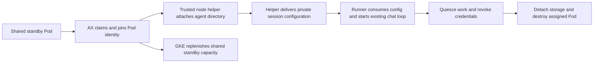

# GKE Agent Sandbox shared pool design

**Status:** Opt-in prototype implemented; isolated GKE/Filestore lifecycle and real provider/Bash turns passed for both SDKs. The Claude Stop fix passed native GKE acceptance and was deployed for direct Agent Sandbox sessions. Shared pools remain disabled pending the [consolidated acceptance checklist](../../deploy/SHARED-POOL-ACCEPTANCE.md). See the [deployment runbook](../../deploy/SHARED-POOL.md) for prerequisites and rollback.
**Date:** 2026-10-01
**Supersedes:** [The per-agent warm pool proposal](2026-10-01-agent-sandbox-warm-pools-design.md).

Use a shared pool of prewarmed gVisor runners. After AX claims a Pod, a trusted helper on its node attaches only the assigned agent's persistent directory and delivers the session configuration. The runner then starts its existing chat loop without a Pod restart.

Pool capacity follows demand, independently of agent count. For example, 100 agents could share three standby Pods, plus Pods serving active conversations and one storage helper per sandbox node. Three is an illustrative capacity setting, not a measured sizing recommendation.

## What we verified

Two Pods from one template and pool were running before either synthetic agent was assigned. Each used the deployed AX image by digest, gVisor, UID 1000, a read-only root filesystem, dropped capabilities, no service-account token, and deny-all networking. Neither contained agent files or session configuration while waiting.

A temporary privileged helper for each claimed Pod received host filesystem access only to that fixture's emptyDir. It had no host PID or network namespace, no Kubernetes token, no real Filestore mount, and no production agent data. Its source directories were synthetic local files.

| Check | Agent A | Agent B |
| --- | --- | --- |
| Claimed a preexisting Pod from the same pool | 759 ms | 644 ms |
| Kernel bind operation | 10 ms | 12 ms |
| Pod UID preserved and runner restarts | Yes; zero | Yes; zero |
| Assigned directory visible | Yes | Yes |
| Runner writes visible in the backing directory | Yes | Yes |
| Other directory, helper source path, or escaping symlink accessible | No | No |
| Temporary assignment file delivered, consumed, and removed | Yes | Yes |

These are two feasibility samples. The bind timings exclude helper startup, an authenticated API request, NFS setup, and runner activation. They do not measure durable NFS persistence or first model response latency. The tested isolation cases do not constitute a complete adversarial filesystem review.

Normal unmount returned `EBUSY` while the gVisor Pod was alive. The corrected probe synced its synthetic filesystem, lazily detached the mount, verified the mount entry was gone from the helper's namespace, deleted the claimed Pods, and then removed the helpers. Its namespace was confirmed absent. Production teardown must additionally prove write quiescence, NFS flush behavior, and correct cleanup in the node's mount namespace.

Reproducible local probe: `/tmp/ax-shared-pool-latebind-probe.mjs`. Passing output: `/tmp/ax-shared-pool-latebind-probe-verified.log`. The earlier normal-unmount failure is retained in `/tmp/ax-shared-pool-latebind-probe.log`; recovery was completed before the corrected run. Production release settings were unchanged.

## Why late attachment works

The current Filestore resolver chooses an NFS subPath from `owner.agentId`. A normal Pod volume fixes that choice before startup. Late binding moves the choice into a trusted node component after claim adoption.

GKE documents host-to-container mount propagation through an emptyDir, enabled with `dev.gvisor.empty-dir.<volume-name>.force-shared: "true"`. The documented minimum is GKE `1.36.0-gke.3302001`; our sandbox node reports `1.36.4-gke.1247000`. See the [upstream shared Filestore example](https://github.com/kubernetes-sigs/agent-sandbox/tree/main/examples/latebind-storage-gke-sandbox). The integrated test reproduced data loss with disk-backed staging: kubelet recursively removed NFS files before detach. We switched to a host-backed tmpfs emptyDir, retained force-shared access through Gofer, and verified real Filestore durability on deletion. Finalizers alone do not prevent disk-backed teardown from deleting mounted contents.

The trusted helper holds the backing share and bind-mounts one validated agent directory beneath the claimed Pod's emptyDir. The whole backing share is never mounted inside a runner. This retains a real filesystem for Bash, SDK file tools, builds, large files, and concurrent same-agent sessions, without copying a directory into scratch and uploading changes later.

We can use the existing Filestore share and directory layout. This does not depend on creating the newer Filestore agent-volume product. Google's [agent-volume late-binding guide](https://docs.cloud.google.com/filestore/docs/agent-sandbox-latebind) has separate evaluation and production-access conditions for that product; the upstream example above uses a shared Regional Filestore volume.

## Shared template and path layout

Pool compatibility contains only static execution requirements: image digest, runner implementation, runtime, resource limits, and required service sidecars. It contains no agent ID, tenant, conversation, session token, or agent mount specification. Any additional pool is for an execution class, not an agent. Dynamic sidecar requirements must have a deliberate compatible class or a documented cold path.

Keep the generic `/agent` and `/ephemeral` volumes. Add a memory-backed 16 MiB late-attachment volume, with HostToContainer propagation and the force-shared annotation, containing fixed directories for user files, optional read-only memory, and local bootstrap configuration. This is a host tmpfs exposed through Gofer, verified on GKE. The helper rejects a disk-backed declaration or an actual non-tmpfs staging filesystem before mounting durable data. Kubelet's tmpfs teardown must unmount the root before removing contents, so child bind mounts block destructive cleanup until the helper detaches them. The limit bounds bootstrap/scratch space, not attached Filestore data. Existing disk accounting covers workspaces and uploaded/published blobs, not arbitrary raw `/files` writes.

Late binding happens below the volume root. Preserve the existing `/files` and optional `/memory` paths through immutable image aliases to those child directories, or an equivalently tested layout. Do not assume binding over an already-open volume root changes gVisor's root descriptor. Test path resolution, SDK cwd and HOME, transcripts, artifact publication, and the existing cold backend against the chosen image layout.

Set template claim environment injection to `Disallowed`: claim `spec.env` bypasses warm adoption, as verified in the [initial probe](2026-10-01-agent-sandbox-warm-pools-design.md). Set `networkPolicyManagement: Unmanaged` so AX keeps control of the existing proxy fence.

## Claim and activation flow

1. AX authorizes the agent and resolves its mount specifications through the existing hooks. It creates a claim without agent-specific environment variables and resolves the assigned Sandbox from claim status.
2. The control plane verifies and pins the Claim, Sandbox, and Pod UIDs, their ownership chain, template identity, and the Pod's node. It installs the required cleanup protection before any storage bind. It never assumes an adopted Pod is named after its claim.
3. AX sends a bounded authenticated assignment to the helper on that node. The helper independently verifies the target Pod and node, validates the configured storage source, and attaches the allowed agent subtree. Read-only memory uses a read-only bind and must remain read-only inside gVisor.
4. Only after all required mounts succeed does the helper atomically publish the private session configuration into the Pod's local bootstrap directory. The file is mode 0600 and addressed only to that Pod and session. It is not written to Filestore, a claim annotation, a ConfigMap, a template, or a log.
5. The waiting runner reads and validates that bounded file once, removes it before starting model or tool work, and initializes its existing session environment. The schema accepts fixed fields and fixed runner choices, never arbitrary executable paths, argv, loader variables, or arbitrary environment names.
6. Normal runner startup hydrates the governed workspace, materializes skills, initializes the transcript, and uses the existing authenticated IPC and credential proxy. Readiness must distinguish a healthy standby from a fully activated session.

The shared runner-core helper waits before session environment reads or model startup. Both concrete runner entrypoints use it and then invoke their own implementations. Module preloading may happen during standby, but its benefit requires auditing SDK imports for early environment reads and measuring actual SDK startup.

The authenticated node helper becomes the trusted delivery channel for session configuration. This supersedes the previous separate runner listener and application encryption proposal. Production needs mutual TLS, endpoint identity verification, replay-resistant assignment IDs, Pod UID binding, atomic file operations, and a single-assignment state machine. The harmless fixture file proved visibility and consumption, not this authentication protocol.

## Teardown and failure recovery

A claimed Pod serves only its assigned session. It never returns to the unassigned pool. Stop keeps the current conversation session available through the existing interrupt path; ending the session quiesces its work, revokes credentials, detaches storage, and destroys the Pod. GKE creates clean replacements.

The controller and node helper must reconcile assignments through cancellation, deadlines, bootstrap failure, Pod loss, host restart, node drain, and node failure. Keep durable assignment metadata on the claim without secrets; reconcile it against actual mounts. Do not create a second agent or session database.

Use cleanup finalizers and node-level mount reconciliation. Finalizers retain API objects for cleanup; they do not by themselves prove that kubelet delays process termination or volume cleanup. Verify real GKE deletion, eviction, and garbage-collection ordering. Add lifecycle hooks where needed and test recovery after the control plane dies midway through a bind or unbind.

The production sequence must stop new work, quiesce processes holding files, flush pending writes as far as the backing filesystem supports, revoke credentials, and detach the target mount. Lazy unmount may be necessary because gVisor holds descriptors, but it is not evidence that writes reached durable storage. Remove cleanup protection only after checking the appropriate node mount state. On node loss, reconcile identities and abandoned mounts without falsely reporting successful flushing.

Put the absolute session deadline on the assigned claim. Do not put a session-relative activeDeadlineSeconds into a reusable standby template, since idle time would consume the later session's lifetime. If the pool is exhausted, a fresh generic Pod can follow the same attachment and activation path.

## Security boundary

The node helper is privileged infrastructure with potential node-level reach. Its compromise is materially more serious than a runner compromise. It belongs in a dedicated administrative namespace and runs a pinned, prebuilt image. Its mounted host paths should be limited to the runner volume area and required private state; it needs no host PID namespace, runtime package installation, or arbitrary host shell endpoint.

Only the trusted control plane can call its bind, configuration-delivery, and unbind APIs. Authenticate with mutual TLS and authorize a fixed controller identity. Deny runner-to-helper traffic and direct storage-network access from runners. Scope helper egress to its required API and Filestore destinations. Preserve host IPC and proxy reach and verify the effective policies on the actual node helper setup.

Neither a model nor a caller provides raw node names, NFS endpoints, host paths, mount options, or shell strings. The control plane derives the assignment from an authorized owner and cluster state; the helper checks it against fixed configuration and the current Pod identity. Use fixed argv and filesystem operations that pin validated directory descriptors. String-prefix checks alone cannot prevent symlink replacement or directory races across this privileged boundary.

The source agent directory and target kubelet volume path must be protected against traversal, symlinks, replacement, and cross-Pod targeting. Check an idempotent binding ledger and reject a second identity for the same Pod. Ownership setup should provision or fix the agent root with bounded work, without recursively traversing agent-controlled content on the message path. Quota enforcement must not assume emptyDir limits constrain the attached NFS directory.

Keep Kubernetes and storage-node details inside sandbox-k8s and its deployment support. The initial integration can retain `sandbox:open-session` and `sandbox:resolve-mounts`. Namespaced pool, claim, template, and finalizer permissions must be explicit. Host-to-runner exec remains unnecessary; the fixture's administrative exec calls are replaced by authenticated helper APIs in production. A separately deployed controller communicates through its own internal protocol rather than cross-plugin imports.

Security checklist for implementation:

- **Sandbox:** New privileged node helper can bind approved agent directories and deliver configuration to pinned runner Pods. This grants node-level trust and requires API isolation, scoped paths, ownership validation, and recovery tests. Runners stay non-root and receive only the assigned subtree.
- **Injection:** Agent files and API payloads remain untrusted. Reject traversal, symlink and mount races, mismatched identities, arbitrary environment keys, and command options. Session secrets are consumed before model execution and excluded from logs and subprocess environments.
- **Supply chain:** The probe used the existing digest-pinned AX image and existing dependencies. The production helper needs its own pinned image, audited runtime dependencies, and a review of any new packages; it must not install utilities at node startup.

## Implementation and acceptance

1. Build the trusted node helper and assignment lifecycle with the minimal API. Test UID and node mismatches, replay, concurrent assignment, path and symlink attacks, partial mounts, and idempotent recovery. Deploy it initially in an isolated acceptance environment.
2. Wire standby startup through runner-core into both runners, and connect claim adoption, mounting, bootstrap delivery, and teardown in sandbox-k8s. Include preset configuration, namespaced RBAC, network policies, image layout, and an end-to-end canary in the same integrated change.
3. Repeat the synthetic checks against isolated real Filestore data. Verify persistence across Pod replacement, writes from Bash and native SDK tools, same-agent concurrent visibility, other-agent isolation, read-only memory, unchanged transcript behavior, and absence of bootstrap secrets after activation.
4. Exercise cancellation during each startup stage, deadlines, Pod deletion, node drain, helper restart, controller restart, and orphan mount reconciliation. Check both cleanup and data durability before enabling production shared claims.
5. Measure claim time, authenticated bind time, activation, workspace hydration, SDK readiness, and first model response separately. Tune standby capacity from hit rate and demand rather than agent count.

The next step is an integrated prototype of the trusted helper and standby startup against isolated Filestore data. Shared adoption and the underlying mount and bootstrap-file visibility have already been proven on our managed cluster.
