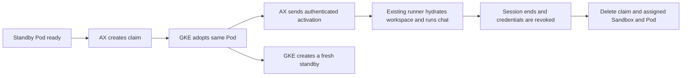

# GKE Agent Sandbox warm pool design

**Status:** Superseded by [the shared pool design](2026-10-01-agent-sandbox-shared-pool-design.md). The user requires shared capacity across agents. The original claim experiments below remain valid; the per-agent pool and separate activation-listener proposals are no longer the recommended implementation.
**Date:** 2026-10-01

AX can remove Pod startup from a new conversation by claiming an already running gVisor runner. The recommended first version keeps a bounded pool for each recently used agent and gives the claimed runner its session credentials through a separate activation step.

This fits the current per-agent file mounts and preserves the host and runner split. A pool setting alone cannot enable it: the existing runner requires a session token at process startup.

## Verified GKE behavior

An isolated test used the deployed runner image by digest on `ax-next-std`, with a harmless Node process, no session credentials or persistent mounts, and a deny-all NetworkPolicy. It created a v1beta1 SandboxTemplate, a SandboxWarmPool with one replica, and three SandboxClaims.

| Test | Result |
| --- | --- |
| Claim without `spec.env` | Adopted the existing Pod UID in 703 ms; zero restarts |
| Pool replenishment | Created a different standby Pod |
| Claim with a harmless `spec.env` entry | Created a fresh Pod in 2,515 ms despite an available standby |
| Another claim without `spec.env` | Adopted that standby Pod UID in 615 ms; zero restarts |
| Foreground claim deletion | Removed each assigned Pod |

These timings cover claim creation through observing a ready Pod. They exclude AX activation, workspace hydration, SDK startup, and the first model response. Two warm samples establish feasibility, not a latency percentile.

The temporary namespace was removed. Production configuration and conversations were unchanged. Probe source and output are `/tmp/ax-agent-sandbox-warm-probe.mjs` and `/tmp/ax-agent-sandbox-warm-probe.log` on the development machine.

The [upstream Go client documentation](https://github.com/kubernetes-sigs/agent-sandbox/blob/main/clients/go/README.md) also states that claim environment variables force a cold start. The managed cluster's served CRD is authoritative for its schema: v1beta1 claims require `warmPoolRef`, and claim status provides the assigned Sandbox name. It differs from older examples that use `sandboxTemplateRef` directly on a claim.

## Why the first pool belongs to an agent

`@ax/workspace-filestore` resolves `/files` to an NFS mount with `subPath = owner.agentId`. The optional `/memory` mount is also agent-specific and read-only. Kubernetes fixes these mounts before a Pod starts; adopting a Pod does not let AX change its agent's subPath.

The first version therefore creates a template per agent and compatible static configuration. It never mounts the entire Filestore root inside a generic runner. Google's [storage guidance](https://docs.cloud.google.com/kubernetes-engine/docs/how-to/agent-sandbox-storage) describes custom scripting and a privileged DaemonSet for attaching storage to claimed warm Pods. That would require a separate security design.

Pool compatibility includes the agent and mount specifications, image digest, chosen runner, runtime and resource limits, service sidecars, bootstrap protocol version, and host signing key generation. Session IDs, credentials, request IDs, and conversation workspace contents stay out of templates.

Proposed initial policy: one standby for each recently used agent profile, an adjustable global cap, and an adjustable idle expiry. Create the pool on first use, and let the controller replenish it after a claim. An agent's first use or a burst that exhausts the pool still takes the cold path. A subsequent change can prewarm on the existing `agents:created` event once ownership and mount resolution are available, or on an authorized preparation request before the first message.

## Runner activation

Both runner entrypoints already export `main()` and share `@ax/agent-runner-core`. Add a standby wait in each entrypoint through that shared package, before reading session environment or starting the agent loop. Static module loading and fixed scaffolding can finish during standby. Each runner invokes its own loop after activation; it does not import another plugin's implementation.

The standby contains no session token, proxy attribution token, conversation workspace, or model-provider key. It may have only its agent's static mounts and the fixed bootstrap configuration. Workspace hydration, installed-skill materialization, transcript initialization, and model work begin after activation.

The proposed bootstrap uses a small listener reachable only from the host:

1. The launcher generates a one-use encryption key and nonce in memory. It writes a bounded public startup record containing the public key, nonce, Pod UID, and profile identity. Readiness requires the listener and record to exist.
2. AX claims without `spec.env`. It resolves the assigned Sandbox from claim status and verifies the Claim → Sandbox → Pod ownership chain, pinning all UIDs. It must not assume the adopted Pod has the claim's name.
3. AX reads the public startup record through the Kubernetes API's existing `pods/log get` permission, with a strict byte limit. It verifies the Pod UID before and after the read. It never obtains an activation key from unauthenticated HTTP or parses model output as a bootstrap record.
4. AX encrypts the session configuration to that launcher's public key and signs the envelope with a host-only key. The signature binds the claim and Pod identities, profile, nonce, expiry, and ciphertext. The template contains only the host's public verification key.
5. The launcher checks the signature, recipient, identity, nonce, expiry, and fixed configuration schema. It accepts one assignment, closes the bootstrap listener, and invokes the runner's existing startup path in the same process.

Use Node's built-in cryptography with an explicit versioned construction, such as X25519 plus HKDF and AES-GCM for encryption, and Ed25519 for the host signature. Validate this construction and failure behavior before implementation ships. Session secrets must never appear in startup logs, HTTP access logs, public metadata, or error messages.

A host key generated in memory at startup avoids putting the private key in a runner template. Its public key generation becomes part of profile compatibility. Host restart must retire unused pools from an old generation and create replacements; it must not silently activate a launcher trusting the wrong key.

Configuration accepts fixed fields and fixed runner choices. It grants no shell endpoint, caller-selected executable, arbitrary argv, or arbitrary environment names such as `NODE_OPTIONS`. Preserve the existing SDK child-process environment filtering so tool subprocesses cannot inherit IPC credentials. Audit SDK imports for environment reads at module initialization before claiming that module preloading eliminates SDK startup work.

## Pool and session lifecycle

A used Pod never returns to the unassigned pool, even for the same agent. Existing conversation reuse and Stop behavior stay in the runner: Stop interrupts a turn; ending the session revokes its credentials and removes its claim.

Move NFS ownership preparation off the message path when constructing a compatible pool. Verify ownership and mount readiness before advertising a standby; retain the existing bounded preparation on a cold fallback. Do not reuse a pool after its mount configuration changes.

Set the claimed session's absolute shutdown deadline on the claim, with `DeleteForeground`. Do not copy a session-relative `activeDeadlineSeconds` into a standby template: time spent waiting would shorten the later session. Verify the controller's deadline and Pod-loss behavior, and keep AX's fail-closed UID replacement checks.

The manager reconciles pools from Kubernetes resources, bounds standby capacity, retires idle or incompatible templates, and handles `agents:deleted`. Pool expiry is host-managed; a host outage can leave idle capacity until reconciliation resumes. Document that behavior and alert on stale pools rather than claiming the controller provides an idle TTL it does not expose.

Cold fallback must be deliberate: pool exhaustion can create a fresh standby-shaped Pod through the claim and activate it. An ownership, signature, or configuration failure destroys that claim and revokes its credentials; it must not silently switch paths while leaving an assigned Pod or live token behind.

## Integration and security

Keep templates, pools, claims, bootstrap transport, and their Kubernetes vocabulary internal to `@ax/sandbox-k8s` and deployment configuration. The existing `sandbox:open-session` contract remains sufficient for the first version. A later preparation hook must be backend-neutral and include the required boundary review.

The host needs namespaced claim, pool, and template permissions for the selected lifecycle operations. Grant pool updates only where required for capacity reconciliation. Preserve the current restrictions against `pods/exec`, attach, port-forward, runner service-account tokens, and cluster-wide permissions. Document the expanded use of the existing bounded `pods/log get` permission for public bootstrap records.

Set templates to `networkPolicyManagement: Unmanaged` and claim environment injection to `Disallowed`. AX's existing policies remain responsible for the proxy fence. Add only host-to-bootstrap ingress and required host egress, preserve runner labels across adoption, and keep direct Internet and other-agent traffic blocked. Prevent a template's default managed policies from widening access.

Security checklist for the proposed implementation:

- **Sandbox:** Adds a bounded host-to-runner activation endpoint. Agent mounts remain isolated; activation is encrypted, signed, UID-bound, and single-use. No exec privilege or full export mount. These properties require implementation tests.
- **Injection:** Bootstrap parsing treats even public log records as untrusted until their identity and schema are checked. No generic environment, executable, or command interpolation. Model work starts only after activation and cannot reactivate the launcher.
- **Supply chain:** Proposed protocol uses Node built-ins and existing dependencies. Any dependency introduced during implementation requires a fresh supply-chain review.

## Implementation order and acceptance

1. Implement the shared standby and activation helper, wire both runner entrypoints, and prove that preloading without session credentials does not start IPC, hydrate a workspace, or run a model. Test bad signatures, replay, expiry, identity mismatch, malformed or oversized bodies, and simultaneous activation.
2. Implement the pool manager and claim lifecycle inside sandbox-k8s. Test compatible profiles, global capacity, replenishment, cold fallback, configuration changes, cancellation during claim or activation, deadlines, host restart, agent deletion, and Pod replacement.
3. Wire preset configuration, minimal namespaced RBAC, network rules, and the actual image entrypoints. Add canary coverage of the entire session-open path; do not merge an unused launcher.
4. Exercise one opted-in agent on GKE. Prove the Pod existed before the first message, the claimed Pod UID and restart count stayed unchanged, other agents' files remained inaccessible, and cancellation revoked credentials before cleanup.
5. Measure claim, activation, workspace hydration, SDK readiness, and first model response separately. Increase capacity only after observing hit rate, misses, idle resources, and actual latency.

The next concrete implementation step is the shared standby and activation helper. Claim adoption is already proven on the managed cluster; authenticated late session configuration is the missing AX capability.
